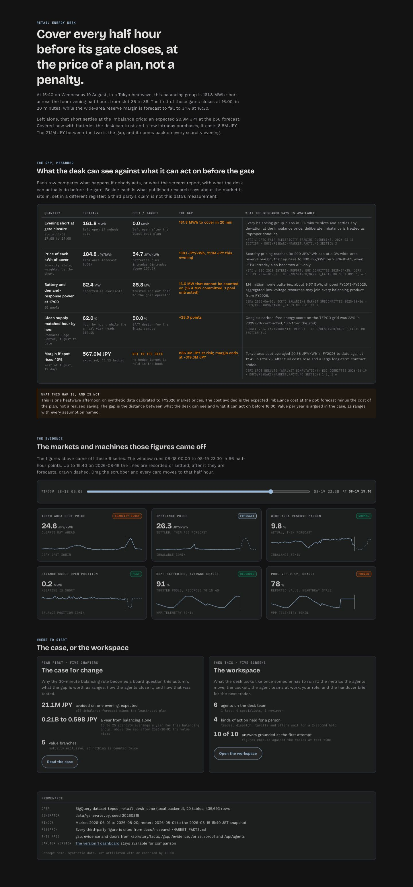
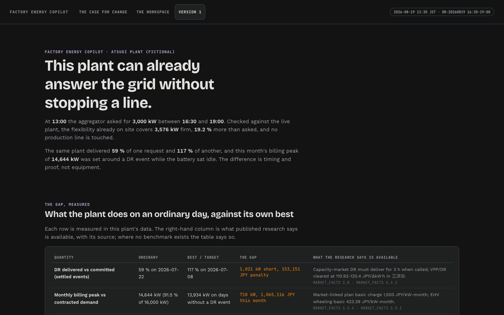
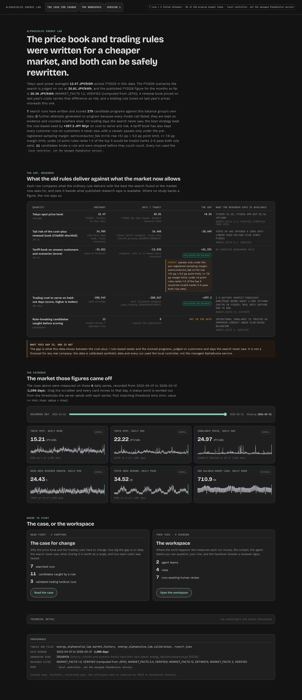
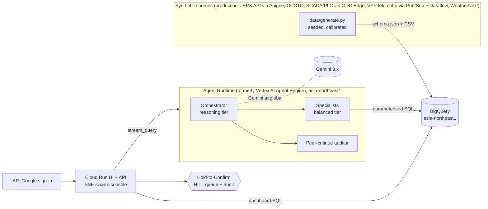

# Japan Energy on Google Cloud: Agentic Concept Demos

Three independent, art-of-the-possible concept demos for the Japanese power market, built on Google Cloud
(Gemini Enterprise Agent Platform / Agent Runtime, ADK, Gemini, BigQuery, Cloud Run) and **tested with agent
evaluation**. Each demo ships its own PRD, technical design, demo script, synthetic data, agents, evaluation suite,
UI and deployment path.

> **Concept demo. Synthetic data.** Not affiliated with or endorsed by TEPCO Energy Partner, TEPCO Power Grid,
> Mitsubishi Electric, JEPX or OCCTO. Company names describe the intended audience only; no logos or brand marks are
> used. Every customer, plant, prospect and figure in the datasets is fictional, calibrated to the public market
> facts in [`docs/research/MARKET_FACTS.md`](docs/research/MARKET_FACTS.md).

| Demo | For | What it shows | Docs |
|---|---|---|---|
| [**Retail Energy Desk**](tepco-retail-vpp/) | TEPCO Energy Partner | A 6-agent ADK swarm on a Tokyo heatwave afternoon: hedge a 161.8 MWh short before gate closure with intraday orders and a Mega-VPP dispatch (excluding a VPP cluster with frozen telemetry), deviation-band and margin-at-risk analysis, 24/7 CFE PPA structuring from a corporate bill (with a prompt injection in it), and an NFC double-claim audit. Every write action waits for a 2 s Hold-to-Confirm. | [PRD](tepco-retail-vpp/docs/PRD.md) · [Design](tepco-retail-vpp/docs/TECHNICAL_DESIGN.md) · [Demo script](tepco-retail-vpp/docs/DEMO_SCRIPT.md) · [Evals](tepco-retail-vpp/docs/EVAL_REPORT.md) |
| [**Factory Energy Copilot**](melco-edge-to-grid/) | Mitsubishi Electric | Edge-to-grid: a 7-agent swarm builds a 3,000 kW demand-response plan for a fictional SiC module plant while a deterministic "GDC Edge" interlock engine accepts or rejects every action in milliseconds (the committed furnace batch is rejected, the plan still lands 3,576 kW). BESS-as-a-Service policy comparison, WeatherNext-style PV risk, compressor-leak and stuck-meter detection, gain-share invoicing. Framed as a proposed collaboration with a first-class multi-cloud story. | [PRD](melco-edge-to-grid/docs/PRD.md) · [Design](melco-edge-to-grid/docs/TECHNICAL_DESIGN.md) · [Demo script](melco-edge-to-grid/docs/DEMO_SCRIPT.md) · [Evals](melco-edge-to-grid/docs/EVAL_REPORT.md) |
| [**AlphaEvolve Energy Lab**](alphaevolve-energy-lab/) | Both | Evolutionary code search on two real problems for a fictional Tokyo balance group: **C&I tariff pricing** (1,200-customer train cohort, separate holdout cohorts, FY2026 Monte Carlo price bank) and **JEPX trading + BESS dispatch** (day-ahead bids, intraday, imbalance). A market model calibrated to FY2023-FY2026 JEPX data, an AlphaEvolve-contract harness (EVOLVE-BLOCKs, sandbox, baseline lock, budget ledger, holdout, evidence files) and policy invariants that reject "wins" that are really rule breaks (intentional imbalance, pricing customers out). | [PRD](alphaevolve-energy-lab/docs/PRD.md) · [Design](alphaevolve-energy-lab/docs/TECHNICAL_DESIGN.md) · [Scenario & data](alphaevolve-energy-lab/docs/SCENARIO_AND_DATA.md) · [Results](alphaevolve-energy-lab/docs/RESULTS.md) · [Evals](alphaevolve-energy-lab/docs/EVAL_REPORT.md) |

## Version 2 UI

Version 2 (tag `v2.0.0`) replaces the v1 control-room dashboards with the editorial, CEO-first design language of the
owner's mining agents reference: a landing that states the thesis and measures the gap in the data against cited
research, a five-chapter case for change (`1 · The case`, `2 · The gap`, `3 · The prize`, `4 · The solution`,
`5 · The proof`), and a workspace (`Value`, `Cockpit`, `Agent teams`, `My role`, `Handover`) where every proposed action
opens a sign-off sheet that shows what the agents could not settle before the 2 s hold. The spec is
[`docs/DESIGN_V2.md`](docs/DESIGN_V2.md) and the shared kit is [`docs/reference/ui-v2/`](docs/reference/ui-v2/).
Version 1 stays reachable at `/v1/` in every demo and at tag `v1.0.0`.

| Retail Energy Desk | Factory Energy Copilot | AlphaEvolve Energy Lab |
|---|---|---|
|  |  |  |

## Architecture (common pattern)



* **Agents never execute.** Write-type tools are `propose_*`; the server lifts pending actions out of the event
  stream and only a human Hold-to-Confirm "executes" them (sandboxed) with an audit record.
* **Same SQL on two engines.** Tools run parameterised SQL on DuckDB-over-CSV locally and on BigQuery when
  deployed (`DATA_BACKEND=bigquery`); a parity test proves they agree.
* **Models by tier, never hardcoded**: `gemini-3.1-pro-preview` (reasoning), `gemini-3.6-flash` (balanced, judge),
  `gemini-3.5-flash-lite` (fast), all served from the `global` location.

## How the demos are tested

Each demo is tested four ways: deterministic `pytest`, ADK `AgentEvaluator` eval sets (tool trajectory, rubric-based
response quality, hallucinations; judge = balanced tier), a grounding eval that recomputes the truth with SQL at
test time and checks the figures in the answer, and a safety eval (prompt injection inside documents, requests that
break market or safety rules, execution without approval). Results as of 2026-09-27 (v2), live on Gemini:

| Demo | pytest | ADK eval | Grounding | Safety | Deployed-agent probes |
|---|---|---|---|---|---|
| Retail Energy Desk | 102 passed, 1 skipped | 18/19 first attempt, 19/19 after one retry | 10/10 | 9/9 | 2/2 grounded from BigQuery |
| Factory Energy Copilot | 149 passed, 1 skipped | 18/18 | 9/9 | 8/8 | 2/2 (anomalies found; unsafe shutdown rejected at the edge) |
| AlphaEvolve Energy Lab | 106 passed | 11/12 after one retry, 10/12 first (1 persistent: per-figure citations when quoting code constants) | 8/8 | 6/6 | 3/3 (run truth matched; promotion refused; run 4 margin caveat stated) |

Skips are named in each eval report (BigQuery-only or local-only tests). Every retry is classified transient or
persistent, and first attempts are kept as evidence.

## AlphaEvolve Lab: what the runs actually found

Seven live runs (280 programs evaluated, about USD 9.6 of Gemini in total; two further attempts generated no program and
are disclosed). All runs used the **local Gemini-driven controller** that speaks the AlphaEvolve contract, because the
demo project has no Gemini Enterprise app with AlphaEvolve provisioned (AlphaEvolve is GA on Google Cloud since
2026-07-10; switching is one flag). So `evolved` stays `false` and nothing is promotable.

* **JEPX trading:** validated holdout gains in all three runs: **+397, +323 and +206 JPY M/yr** versus the
  hand-written seed on unseen FY2025 days plus stress days. Most of the gain comes from cold-snap days. The
  invariants caught three candidates that "won" by leaving slots deliberately short (intentional imbalance,
  prohibited under the 30-minute balancing rule).
* **Tariff pricing, runs 1-3:** the search found a real hedging mechanism, but every champion broke the per-segment
  churn limit on small unseen cohorts (5 to 17 customers per segment), so no citable uplift.
* **Tariff pricing, run 4 (pre-registered, 2026-09-27):** a fresh 1,200-customer holdout (`holdout3`) and per-segment
  churn limits judged with a sampling margin, both fixed in
  [`PREREGISTRATION_tariff_v4.md`](alphaevolve-energy-lab/docs/PREREGISTRATION_tariff_v4.md) before any candidate was
  scored. Result: **validated holdout delta +21,191 JPY M** (risk-adjusted score; seed -35,021, best -13,830), mostly
  from lower tail risk (expected margin alone +6,745 JPY M). **Caveat, carried everywhere the number appears:** the
  champion passes only under the pre-registered sampling margin (semiconductor fabs, n=14: churn rise +5.1 pp against a
  5.0 pp point limit and a 7.6 pp margin limit); under the stricter v3 point rules ranks 1-2 would be invalid and ranks
  3-5 still pass. The Lab Analyst agent reads this caveat from a recomputed `lab_segment_judgments` table and states it.

See [RESULTS.md](alphaevolve-energy-lab/docs/RESULTS.md).

## Run locally

```bash
python3.12 -m venv .venv && .venv/bin/pip install -r tepco-retail-vpp/requirements.txt
export GOOGLE_GENAI_USE_VERTEXAI=TRUE GOOGLE_CLOUD_LOCATION=global GOOGLE_CLOUD_PROJECT=<your-project>
cd tepco-retail-vpp && ../.venv/bin/python data/generate.py && ../.venv/bin/python -m uvicorn server.app:app --port 8081
```

The same pattern works for `melco-edge-to-grid` (port 8082) and `alphaevolve-energy-lab` (port 8083). Dashboards work
without model access; chat and evals need Gemini on Vertex. Each demo README has details.

## Deploy to Google Cloud

[`tools/gcp_deploy.py`](tools/gcp_deploy.py) deploys any demo with Application Default Credentials only (no gcloud
CLI needed), verifying each step: BigQuery load with row-count checks, Agent Runtime deployment, Cloud Build to
Cloud Run, and optional IAP browser access for named users.

```bash
export GOOGLE_CLOUD_PROJECT=<your-project>
python tools/gcp_deploy.py bq-load      --demo tepco-retail-vpp --dataset tepco_retail_desk_demo
python tools/gcp_deploy.py agent-engine --demo tepco-retail-vpp --package retail_desk \
       --display-name "TEPCO Retail Energy Desk swarm (concept demo)" --dataset tepco_retail_desk_demo --env MODEL_LOCATION=global
python tools/gcp_deploy.py cloud-run    --demo tepco-retail-vpp --service tepco-retail-desk-demo \
       --env AGENT_BACKEND=agent_engine --env AGENT_ENGINE_ID=<resource name from previous step> \
       --env DATA_BACKEND=bigquery --env BQ_DATASET=tepco_retail_desk_demo --dataset tepco_retail_desk_demo \
       --iap-member user:<you@your-domain>
```

Access is granted to named members only. A domain-wide grant is a deliberate, separate decision; do not copy a
sandbox-wide binding into a production project.

## Repository map

```
docs/research/MARKET_FACTS.md   cited Japan power-market fact sheet + simulation parameters (156 verified, 22 estimates)
docs/CONVENTIONS.md             engineering contract shared by the three demos
docs/reference/                 verified reference patterns (datastore, SSE server, eval config, UI tokens, Hold-to-Confirm)
tools/gcp_deploy.py             ADC-only deployer (BigQuery, Agent Runtime, Cloud Build, Cloud Run, IAP)
tools/secret_scan.py            pre-publish scan for secrets and environment identifiers
tepco-retail-vpp/  melco-edge-to-grid/  alphaevolve-energy-lab/
```

## License

Apache 2.0. See [LICENSE](LICENSE).
