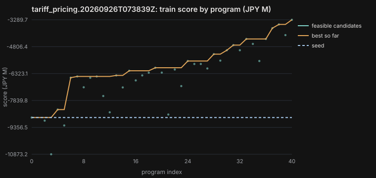
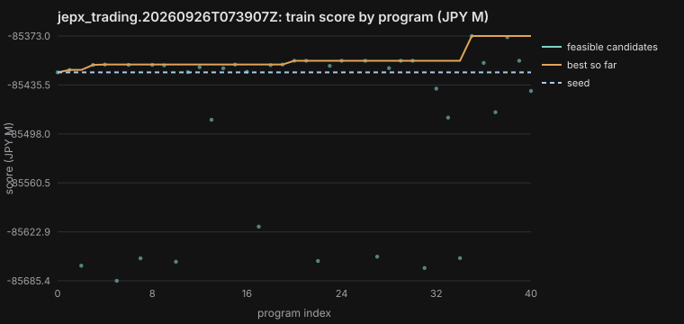
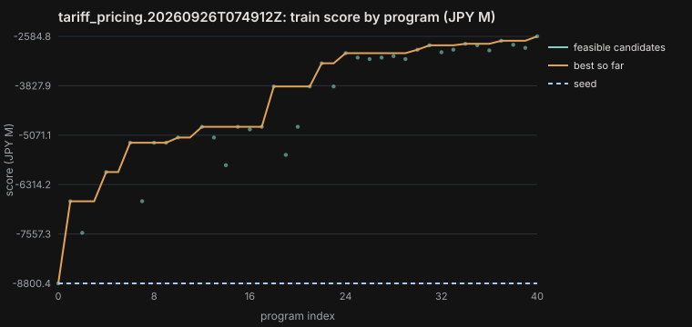
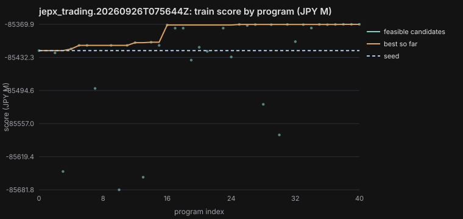
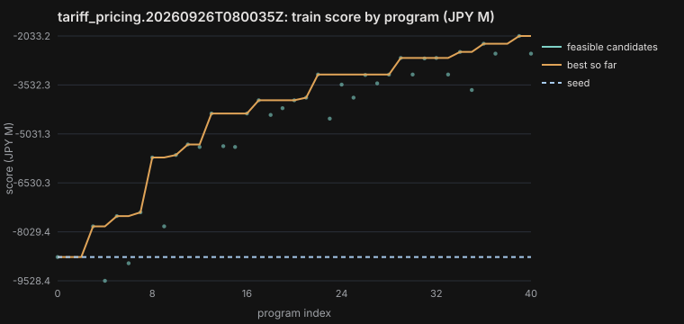
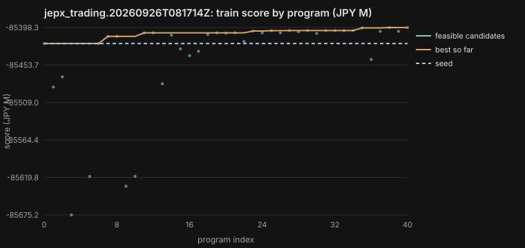

# Results: live evolutionary runs (2026-09-26)

**Provenance, stated plainly:** AlphaEvolve-compatible run, local controller; production run pending GE app
provisioning; switching is one flag (`--backend alphaevolve`). Every evidence file below has
`source: "local-gemini-controller"` and `evolved: false`, whatever its scores. Mutators: gemini-3.6-flash (weight 0.7)
and gemini-3.1-pro-preview (0.3) at location global, thinking level MEDIUM. Tables in this file are rendered from
`runs/*.json` by `data/render_results.py`; the narrative interprets them.

Scores are JPY M, higher is better. Tariff: E[portfolio margin] - 0.5 x CVaR95 shortfall + retained lifetime value over
64 FY2026 scenarios. Trading: -(annualised cost to serve + tail-risk penalty) over the evaluated days (so trading scores
are large negative numbers; the holdout fold includes 16 stress days, which is why its absolute cost is higher).
**The only uplift number that may be cited is `holdout_delta = best_holdout - holdout_seed`, with the champion chosen on
TRAIN score.**

## 1. Summary table

<!-- RUN_TABLE -->
| Run | Problem | Evaluator | Seed (train) | Null raw (train) | Best train | Holdout seed | Best holdout (champion) | Holdout delta | uplift_valid | Invalid caught (by kind) | Programs | Cost (USD est.) |
|---|---|---|---|---|---|---|---|---|---|---|---|---|
| `tariff_pricing.20260926T073839Z` | tariff_pricing | v1 | -8,800.4 | -10,827.9 (invalid) | -3,289.7 | -11,922.9 (holdout) | n/a | n/a | False | policy:churn 1 | 40 | 1.05 |
| `jepx_trading.20260926T073907Z` | jepx_trading | v1 | -85,419.4 | -85,393.6 (invalid) | -85,373.0 | -208,944.6 (holdout) | -208,547.3 | 397.3 | True | policy:intentional_imbalance 1 | 40 | 1.66 |
| `tariff_pricing.20260926T074912Z` | tariff_pricing | v2 | -8,800.4 | -10,827.9 (invalid) | -2,584.8 | -11,922.9 (holdout) | n/a | n/a | False | policy:churn 2, diff 1 | 40 | 1.10 |
| `jepx_trading.20260926T075644Z` | jepx_trading | v1 | -85,419.4 | -85,393.6 (invalid) | -85,369.9 | -208,944.6 (holdout) | -208,621.4 | 323.2 | True | policy:intentional_imbalance 2, diff 1 | 40 | 1.68 |
| `tariff_pricing.20260926T080035Z` | tariff_pricing | v3 | -8,800.4 | -10,827.9 (invalid) | -2,033.2 | -10,874.0 (holdout2) | n/a | n/a | False | policy:churn 3 | 40 | 1.18 |
| `jepx_trading.20260926T081714Z` | jepx_trading | v2 | -85,421.9 | -85,393.6 (invalid) | -85,398.3 | -208,950.2 (holdout) | -208,744.5 | 205.8 | True | sandbox 1 | 40 | 1.80 |
<!-- /RUN_TABLE -->

Null programs: tariff = one flat rate for everyone; trading = buy the D-1 forecast at the cap, no battery, no intraday.
Both nulls are **invalid** under the policy invariants (the flat book prices out fabs and data centres, churn 47.5% and
36.9%; the no-intraday strategy leaves ~1,100 slots outside the compliance band), so the table shows their raw objective.

## 2. Tariff pricing: three runs, three evaluator versions

**Run 1 (evaluator v1).** Train improved from -8,800 to -3,290 JPY M in 40 programs. The champion (gemini-3.1-pro)
raised the market-link share by risk appetite and flexibility (energy-weighted alpha 0.11 -> 0.46), cut the CVaR95
shortfall from 34,905 to 20,705 JPY M, shared DR value with 25.5 MW enrolled, tightened the deviation band to 5.5%, and set
segment margins (0.75 JPY/kWh for water utilities and fabs, 0.95 for universities / data centres / hospitals, 1.20
otherwise). **On the holdout cohort the champion breaks the per-segment churn limit (university 26.2% > 25%)**, and so do
the #2 and #3 train candidates. `uplift_valid = false`: **no validated uplift**. Reading the diff: the search shed fixed-price
tail risk by repricing a small, risk-averse segment (university churn 11.8% on the incumbent book -> ~24% on train).
That is the SOL-01 pattern: a strategy change the score did not price.

**Run 2 (evaluator v2: train guard band 14% portfolio / 22% segment).** Train improved further (-8,800 -> -2,585) and the
guard band held on train, but the champion again failed on holdout (university 25.6%), as did ranks 2-4. **No validated
uplift.** Only rank 5 was valid on holdout; citing it would be selecting on the holdout, which the rule forbids.

**Diagnosis and evaluator v3.** Re-scoring shows the holdout cohort's universities churn 19.9% under the *incumbent* book
(11.8% on train): a fixed guard band cannot absorb cohort sampling in a ~17-customer segment. v3 encodes what the
incumbent book protects: *on every fold, no segment's churn may rise more than 5 pp above the incumbent book's churn for
that segment on the same cohort* (plus the v2 guard band). Because our own diagnosis used holdout 1, **holdout 1 is
burned for tariff**: run 3 is judged on a fresh cohort (400 customers, seed 31) and a fresh holdout scenario bank
(seed 505), `tariff_pricing_holdout2`. The 5 pp threshold was chosen as a business rule before any holdout2 result
existed. Evidence of runs 1 and 2 is unchanged (never overwritten).

**Run 3 (evaluator v3, fresh holdout2).** Train improved the most of the three runs (-8,800 -> -2,033 JPY M): a
market-link share by risk appetite (0.18 / 0.50 / 0.70 plus flexibility and segment bumps, capped at 0.30 for essential
facilities), procurement-style margins (tender -0.38 JPY/kWh, auto-renew +0.15), a gentle competitor-quote adjustment,
DR discounts at 70% of the DR value estimate and a 5% deviation band with a 2.2 JPY/kWh penalty. **All five top train
candidates again fail on the fresh holdout**, this time on semiconductor fabs (incumbent 18.9% -> 25.0% churn), a segment
with about 5 customers in the 401-customer holdout cohort. **No validated uplift.** The tariff budget then hit the
120-program daily cap and the ledger refused further tariff runs today.

**Tariff conclusion (three runs, three evaluator versions, two holdouts).** The risk-transfer mechanism generalises: on
holdout2 the champion's *raw* objective is -4,648 JPY M against the seed's -10,874 (CVaR95 shortfall roughly halves),
but that number is **not citable** because the book breaks segment retention protection on unseen customers. Every run's
search pushed retention in the smallest, most price-sensitive segments to the edge of whatever limit the train fold
enforced, and the holdout cohort's small segments (5 to 17 customers) tipped over. The honest findings are: (1) the
score undervalues retention in small segments, and (2) a 401-customer holdout cannot judge per-segment limits on
5-customer segments. Next step (not run, budget exhausted): a holdout cohort as large as the train cohort, per-segment
limits judged with a sampling margin, then re-run; only a positive holdout delta from that design may be cited.

## 3. JEPX trading

**Run 1.** Train improved from -85,419.4 to -85,373.0 JPY M/yr (+46.5). The champion (gemini-3.1-pro, via a
gemini-3.6-flash DP ancestor) replaced cheapest-4 / dearest-4 arbitrage with a **48-slot state-of-charge dynamic programme**
(50-point SOC grid, 13 power levels, terminal SOC value) that prices slots at p90 when the reserve-margin forecast is below
8% and at a p50/p90 blend below 12%, and it cut the intraday hedge from 50% to 10% of the forecast gap while using up to
95% of the compliance band. Battery cycling rose from 0.14 to 0.25 cycles/day (degradation 72 -> 132 JPY M/yr), terminal
SOC losses fell from 27 to 1 JPY M/yr. **Holdout (FY2025 96 days + 16 stress days): +397.3 JPY M, every slot compliant,
`uplift_valid = true`** (still `evolved = false`: local controller). Decomposition of the champion's raw saving over the
112 holdout days (86.5 JPY M before annualisation): **66.1 JPY M from the 8 cold-snap/LNG days**, 12.4 from the 8
heat-dome days, 8.0 from the 96 normal FY2025 days (~0.08 JPY M/day, about 30 JPY M/yr). The rest of the score delta is
the terminal-SOC and tail-risk terms. In plain words: the evolved policy mostly earns its keep by pre-positioning the
battery for scarcity; on calm days it is roughly break-even against 8 JPY/kWh wear, consistent with MARKET_FACTS 12.

Review item for humans: the champion deliberately uses up to 95% of the per-slot compliance band (|imbalance| 1.0% -> 1.6%
of load) instead of trading those errors intraday. It passes both the per-slot tolerance and the +/-0.5% systematic-bias
check, so it is compliant as specified; whether the 3% band itself is right is an evaluator-specification question for
the desk, not something the search should decide.

**Run 2.** An independent search (different seed) reached the same place by a different route: a multi-pass greedy
pairwise battery arbitrage with 0.5 MW steps, reserve-margin-aware pair values, and intraday orders only when a slot is
close to breaching the compliance band. Train +49.6 JPY M/yr; **holdout delta +323.2 JPY M, every slot compliant,
`uplift_valid = true`**. Raw saving over the 112 holdout days: 14.7 JPY M on the 96 normal days (better than run 1's
8.0), 36.1 on the cold-snap days, 9.3 on the heat-dome days. It cycles harder (0.38 cycles/day on holdout, wear
202 JPY M/yr). Two candidates were caught for intentional imbalance (one left 25 slots short or long, e.g. 20.7 MWh short
in a slot where imbalance was above spot).

**Evaluator-specification check on the terminal SOC term (trading v2).** About 115 JPY M of each annualised holdout
delta is the terminal-SOC term: the champions end the 8-day stress blocks with a fuller battery. v1 valued that change at
the block's mean price with no losses. Re-scoring the seed and both champions with a corrected valuation (deficit at
mean / charge efficiency, surplus at mean x discharge efficiency minus wear) gives holdout deltas of **+395.8** (run 1)
and **+317.9** (run 2) versus +397.3 and +323.2 recorded: the result is robust, the credit is real value (entering the
next period charged during a scarcity event). v2 is the evaluator from now on (re-locked; seed -85,421.9 JPY M/yr).
The recorded evidence of runs 1 and 2 is unchanged.

**Run 3 (evaluator v2, the final trading evaluator).** A third independent search (seed 41) produced a champion that
weights day-ahead price expectations by reserve-margin scarcity, schedules the battery on exact round-trip economics and
trades intraday asymmetrically inside the tolerance band. Train +23.6 JPY M/yr; **holdout delta +205.8 JPY M, every slot
compliant, `uplift_valid = true`**. No policy catches in this run; one candidate crashed in the sandbox (KeyError on a
context field that does not exist) and was recorded as invalid.

**Trading conclusion.** Three independent local-controller runs, two evaluator versions, three positive holdout deltas
(+397.3 and +323.2 under v1, re-scored +395.8 and +317.9 under v2; +205.8 under v2). The gains are real in the model
and concentrated in scarcity: most of each delta comes from stress days, and calm-day gains are small against battery
wear. Four candidates across the runs tried to leave slots short or long of the forecast and were rejected.

## 4. Score curves

<!-- SCORE_FIGS -->

<!-- /SCORE_FIGS -->

## 5. Holdout rescoring (top 5 train candidates per run)

<!-- HOLDOUT_TABLES -->

**`tariff_pricing.20260926T073839Z`** (holdout fold `holdout`; seed -11,922.9; champion = best train score):

| Rank | Program | Train | Holdout | Valid on holdout | First holdout insight |
|---|---|---|---|---|---|
| 1 | `p040-56530207` | -3,289.7 | n/a | False | segment churn > 25%: university 26.2% (pricing customers out is a strategy change, not an uplift) |
| 2 | `p039-00ae02e6` | -3,550.8 | n/a | False | segment churn > 25%: university 25.5% (pricing customers out is a strategy change, not an uplift) |
| 3 | `p037-aec5456a` | -3,764.9 | n/a | False | segment churn > 25%: university 25.1% (pricing customers out is a strategy change, not an uplift) |
| 4 | `p038-71068000` | -4,152.9 | -6,704.4 | True | E[margin] -2669.6 - 0.5 x CVaR95 8899.7 + LTV 415.1 = -6704.4 JPY M |
| 5 | `p034-081bfda5` | -4,370.4 | -7,114.3 | True | E[margin] -2772.4 - 0.5 x CVaR95 9503.5 + LTV 409.9 = -7114.3 JPY M |

**`jepx_trading.20260926T073907Z`** (holdout fold `holdout`; seed -208,944.6; champion = best train score):

| Rank | Program | Train | Holdout | Valid on holdout | First holdout insight |
|---|---|---|---|---|---|
| 1 | `p035-e0bc238b` | -85,373.0 | -208,547.3 | True | annual cost 208466.1 + risk penalty 81.2 => score -208547.3 JPY M; vs buy-actual-at-DA benchmark -0.125 JPY/kWh |
| 2 | `p038-97369915` | -85,374.5 | -208,546.4 | True | annual cost 208465.2 + risk penalty 81.1 => score -208546.4 JPY M; vs buy-actual-at-DA benchmark -0.125 JPY/kWh |
| 3 | `p018-6100f63c` | -85,404.6 | -208,603.2 | True | annual cost 208545.3 + risk penalty 58.0 => score -208603.2 JPY M; vs buy-actual-at-DA benchmark -0.112 JPY/kWh |
| 4 | `p022-2ffdd10f` | -85,404.6 | -208,603.2 | True | annual cost 208545.3 + risk penalty 58.0 => score -208603.2 JPY M; vs buy-actual-at-DA benchmark -0.112 JPY/kWh |
| 5 | `p025-de3b0d25` | -85,404.6 | -208,603.2 | True | annual cost 208545.3 + risk penalty 58.0 => score -208603.2 JPY M; vs buy-actual-at-DA benchmark -0.112 JPY/kWh |

**`tariff_pricing.20260926T074912Z`** (holdout fold `holdout`; seed -11,922.9; champion = best train score):

| Rank | Program | Train | Holdout | Valid on holdout | First holdout insight |
|---|---|---|---|---|---|
| 1 | `p040-3a299406` | -2,584.8 | n/a | False | segment churn > 25%: university 25.6% (pricing customers out is a strategy change, not an uplift) |
| 2 | `p037-2298696d` | -2,697.1 | n/a | False | segment churn > 25%: university 25.6% (pricing customers out is a strategy change, not an uplift) |
| 3 | `p034-931397c4` | -2,771.5 | n/a | False | segment churn > 25%: university 26.0% (pricing customers out is a strategy change, not an uplift) |
| 4 | `p038-ec3c9407` | -2,797.9 | n/a | False | segment churn > 25%: university 25.1% (pricing customers out is a strategy change, not an uplift) |
| 5 | `p032-925fd727` | -2,810.6 | -5,601.7 | True | E[margin] -1917.7 - 0.5 x CVaR95 7750.6 + LTV 191.3 = -5601.7 JPY M |

**`jepx_trading.20260926T075644Z`** (holdout fold `holdout`; seed -208,944.6; champion = best train score):

| Rank | Program | Train | Holdout | Valid on holdout | First holdout insight |
|---|---|---|---|---|---|
| 1 | `p039-1d886ecb` | -85,369.9 | -208,621.4 | True | annual cost 208558.7 + risk penalty 62.7 => score -208621.4 JPY M; vs buy-actual-at-DA benchmark -0.110 JPY/kWh |
| 2 | `p037-4f6d1de2` | -85,369.9 | -208,595.1 | True | annual cost 208530.9 + risk penalty 64.2 => score -208595.1 JPY M; vs buy-actual-at-DA benchmark -0.114 JPY/kWh |
| 3 | `p038-f02270a0` | -85,370.1 | -208,618.5 | True | annual cost 208555.7 + risk penalty 62.9 => score -208618.5 JPY M; vs buy-actual-at-DA benchmark -0.110 JPY/kWh |
| 4 | `p025-498832ec` | -85,370.1 | -208,619.7 | True | annual cost 208556.9 + risk penalty 62.8 => score -208619.7 JPY M; vs buy-actual-at-DA benchmark -0.110 JPY/kWh |
| 5 | `p028-c0d5414d` | -85,370.4 | -208,613.1 | True | annual cost 208549.9 + risk penalty 63.3 => score -208613.1 JPY M; vs buy-actual-at-DA benchmark -0.111 JPY/kWh |

**`tariff_pricing.20260926T080035Z`** (holdout fold `holdout2`; seed -10,874.0; champion = best train score):

| Rank | Program | Train | Holdout | Valid on holdout | First holdout insight |
|---|---|---|---|---|---|
| 1 | `p039-acb6b2de` | -2,033.2 | n/a | False | segment churn rises more than 5% above the incumbent book: semiconductor_fab 18.9% -> 25.0%, university 17.0% -> 22.8%; segment churn > 25%: semicondu |
| 2 | `p036-6b1ab40e` | -2,270.5 | n/a | False | segment churn rises more than 5% above the incumbent book: semiconductor_fab 18.9% -> 24.8%, university 17.0% -> 22.1% (pricing customers out is a str |
| 3 | `p034-0bf05466` | -2,519.8 | n/a | False | segment churn rises more than 5% above the incumbent book: semiconductor_fab 18.9% -> 25.2%; segment churn > 25%: semiconductor_fab 25.2% (pricing cus |
| 4 | `p037-7d2a22fa` | -2,572.0 | n/a | False | segment churn rises more than 5% above the incumbent book: semiconductor_fab 18.9% -> 25.2%; segment churn > 25%: semiconductor_fab 25.2% (pricing cus |
| 5 | `p040-e769aae1` | -2,573.3 | n/a | False | segment churn rises more than 5% above the incumbent book: semiconductor_fab 18.9% -> 24.9% (pricing customers out is a strategy change, not an uplift |

**`jepx_trading.20260926T081714Z`** (holdout fold `holdout`; seed -208,950.2; champion = best train score):

| Rank | Program | Train | Holdout | Valid on holdout | First holdout insight |
|---|---|---|---|---|---|
| 1 | `p037-60e4877a` | -85,398.3 | -208,744.5 | True | annual cost 208680.4 + risk penalty 64.1 => score -208744.5 JPY M; vs buy-actual-at-DA benchmark -0.090 JPY/kWh |
| 2 | `p040-d9b8d78d` | -85,398.3 | -208,744.5 | True | annual cost 208680.4 + risk penalty 64.1 => score -208744.5 JPY M; vs buy-actual-at-DA benchmark -0.090 JPY/kWh |
| 3 | `p035-78cae0d8` | -85,398.8 | -208,638.0 | True | annual cost 208582.1 + risk penalty 55.9 => score -208638.0 JPY M; vs buy-actual-at-DA benchmark -0.106 JPY/kWh |
| 4 | `p027-baae6243` | -85,402.6 | -208,739.5 | True | annual cost 208678.6 + risk penalty 61.0 => score -208739.5 JPY M; vs buy-actual-at-DA benchmark -0.090 JPY/kWh |
| 5 | `p031-b8362f9c` | -85,402.6 | -208,739.5 | True | annual cost 208678.6 + risk penalty 61.0 => score -208739.5 JPY M; vs buy-actual-at-DA benchmark -0.090 JPY/kWh |
<!-- /HOLDOUT_TABLES -->

## 6. Invalid candidates caught by a policy invariant

Each row is a candidate that never entered the population. "Would have scored" is the raw objective before the gate.

<!-- CATCH_TABLE -->
| Run | Candidate | Model | Invariant | Would have scored | Evaluator insight |
|---|---|---|---|---|---|
| `tariff_pricing.20260926T073839Z` | #1 `p002-64e7411b` | gemini-3.1-pro-preview | churn | -1,639.9 | portfolio churn 15.8% > 15%; energy-weighted churn 19.5% > 15%; segment churn > 25%: semiconductor_fab 36.7%, water_utility 30.4%, university 25.0% (pricing customers out is a strategy change, not an uplift) |
| `jepx_trading.20260926T073907Z` | #25 `p024-e5177a68` | gemini-3.6-flash | intentional_imbalance | -85,472.4 | 3 violation(s); e.g. 2024-06-18 slot 36: planned 408.4 MWh vs forecast 440.7 MWh (short 32.3 > tol 13.2); imbalance 38.08 vs spot 25.32 JPY/kWh / 2024-09-19 slot 30: planned 444.3 MWh vs forecast 430.8 MWh (long 13.5 > tol 12.9); imbalance 0.00 vs spot 13.09 J |
| `tariff_pricing.20260926T074912Z` | #3 `p004-c4bf3ea1` | gemini-3.1-pro-preview | churn | -6,995.6 | segment churn > 22% (train guard band): semiconductor_fab 23.0%, water_utility 23.3% (pricing customers out is a strategy change, not an uplift) |
| `tariff_pricing.20260926T074912Z` | #5 `p005-09d6cd0d` | gemini-3.1-pro-preview | churn | -7,318.5 | energy-weighted churn 14.4% > 14% (train guard band); segment churn > 22% (train guard band): semiconductor_fab 23.1%, water_utility 23.6% (pricing customers out is a strategy change, not an uplift) |
| `jepx_trading.20260926T075644Z` | #1 `p002-3c04f053` | gemini-3.6-flash | intentional_imbalance | -85,665.5 | 25 violation(s); e.g. 2024-04-08 slot 39: planned 380.4 MWh vs forecast 392.8 MWh (short 12.4 > tol 11.8); imbalance 41.62 vs spot 23.75 JPY/kWh / 2024-05-13 slot 35: planned 403.9 MWh vs forecast 424.5 MWh (short 20.7 > tol 12.7); imbalance 22.30 vs spot 20.6 |
| `jepx_trading.20260926T075644Z` | #8 `p008-ab16247e` | gemini-3.6-flash | intentional_imbalance | -85,534.3 | 2 violation(s); e.g. 2024-09-19 slot 30: planned 444.3 MWh vs forecast 430.8 MWh (long 13.5 > tol 12.9); imbalance 0.00 vs spot 13.09 JPY/kWh / 2024-09-20 slot 26: planned 450.1 MWh vs forecast 431.7 MWh (long 18.5 > tol 13.0); imbalance 30.25 vs spot 16.51 JP |
| `tariff_pricing.20260926T080035Z` | #1 `p002-76630950` | gemini-3.1-pro-preview | churn | -3,824.3 | segment churn rises more than 5% above the incumbent book: semiconductor_fab 20.3% -> 30.9%, water_utility 16.8% -> 27.7%, university 11.8% -> 20.9%; portfolio churn 14.3% > 14% (train guard band); energy-weighted churn 18.1% > 14% (train guard band); segment  |
| `tariff_pricing.20260926T080035Z` | #2 `p001-c5a073a5` | gemini-3.6-flash | churn | -4,629.3 | segment churn > 22% (train guard band): semiconductor_fab 22.9% (pricing customers out is a strategy change, not an uplift) |
| `tariff_pricing.20260926T080035Z` | #38 `p038-67ecb9fd` | gemini-3.6-flash | churn | -1,826.8 | segment churn > 22% (train guard band): semiconductor_fab 22.2% (pricing customers out is a strategy change, not an uplift) |
<!-- /CATCH_TABLE -->

Examples worth showing: the trading intentional-imbalance catch (a slot left 32 MWh short while imbalance was cheaper
than spot), and every tariff churn catch (repricing a segment out). Diff-application failures (`diff`) are counted as
programs (they cost a model call) and are listed in the evidence with the raw reply.

## 7. Cost and tokens

<!-- TOKEN_TABLE -->
| Run | LLM calls | Prompt tokens | Output tokens | Thinking tokens | Flash calls | Pro calls | Wall (s) | Stopped |
|---|---|---|---|---|---|---|---|---|
| `tariff_pricing.20260926T073839Z` | 40 | 224,673 | 55,971 | 144,068 | 31 | 9 | 510.6 | max_programs |
| `jepx_trading.20260926T073907Z` | 40 | 312,805 | 90,747 | 296,207 | 33 | 7 | 927.9 | max_programs |
| `tariff_pricing.20260926T074912Z` | 40 | 258,761 | 57,452 | 136,501 | 30 | 10 | 460.3 | max_programs |
| `jepx_trading.20260926T075644Z` | 40 | 304,700 | 67,400 | 273,026 | 27 | 13 | 837.2 | max_programs |
| `tariff_pricing.20260926T080035Z` | 40 | 248,039 | 60,737 | 150,223 | 30 | 10 | 495.1 | max_programs |
| `jepx_trading.20260926T081714Z` | 40 | 288,898 | 83,170 | 294,036 | 28 | 12 | 931.1 | max_programs |
| **total** | 240 | | | | | | | USD 8.48 est. |
<!-- /TOKEN_TABLE -->

Cost is an estimate from token counts at assumed prices (balanced 0.50 / 3.00, reasoning 2.00 / 12.00 USD per 1M tokens,
overridable via PRICE_* env vars), not a billing figure. A 2-program live smoke test (about USD 0.24) and offline
dry-runs were run in scratch directories before the real runs and are not part of the evidence. Budget ledger:
`runs/ledger.json` (tariff 3 runs / 120 programs = the daily cap; trading 2 runs / 80 programs).

## 8. What this means

* The harness did its job: it separated train progress from validated uplift, caught 1 intentional-imbalance strategy
  and several segment-repricing strategies at score time, and turned two tariff failures into an evaluator
  specification change with a fresh holdout.
* Trading shows a validated holdout delta on the local controller, concentrated in stress days.
* Nothing here is promotable: promotion needs a real AlphaEvolve run (`source == alphaevolve`) plus human review.
