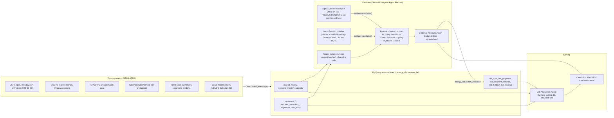

# Technical design: AlphaEvolve Energy Lab

## 1. Architecture



Simulated in the demo: every source system (generated deterministically), the AlphaEvolve service (replaced by the local
controller behind the same contract), JEPX order routing (the trading simulator settles against synthetic clearing).
Production: real sources into BigQuery, the AlphaEvolve adapter (`energy_lab/harness/alphaevolve_adapter.py`), Apigee
in front of the JEPX API, Agent Runtime + Cloud Run in asia-northeast1 (models at `global`).

## 2. Data model

Authoritative dictionary: `data/schema.json` (copied to `energy_lab/schema.json`, which is what Agent Runtime ships).
Types are STRING, INT64, FLOAT64, BOOL; dates are ISO strings; SQL is portable between DuckDB and BigQuery
(`energy_lab/datastore.py`, copied unchanged from the reference). Key relationships:

* `market_history` (ts, date, slot) joins `calendar` on date; `trading_days` lists which dates each trading fold uses.
* `customers_train.customer_id` = `customer_behaviour_train.customer_id` (1:1; visible vs hidden split).
* `segment_archetypes.segment` = `segments.segment` = `customers_*.segment`.
* `lab_runs.run_id` 1:N `lab_programs`, `lab_invariant_catches`, `lab_holdout`, `lab_reviews`;
  `lab_runs.best_program_id` = `lab_programs.program_id`.

DDL (BigQuery, generated from schema.json by `bq load --schema`; example):

```sql
CREATE TABLE `${GOOGLE_CLOUD_PROJECT}.energy_alphaevolve_lab.lab_runs` (
  run_id STRING, problem STRING, source STRING, backend STRING, evolved BOOL, started STRING, finished STRING,
  programs_evaluated INT64, valid_count INT64, invalid_count INT64, stopped_reason STRING, wall_s FLOAT64,
  seed_train FLOAT64, null_train_raw FLOAT64, null_train_valid BOOL, best_train FLOAT64, best_program_id STRING,
  train_delta_vs_seed FLOAT64, holdout_seed FLOAT64, holdout_null_raw FLOAT64, best_holdout FLOAT64,
  holdout_delta FLOAT64, uplift_valid STRING, uplift_note STRING, llm_calls INT64, prompt_tokens INT64,
  output_tokens INT64, thinking_tokens INT64, cost_usd_est FLOAT64, model_mix STRING, instance_train_sha STRING,
  instance_holdout_sha STRING, best_rationale STRING, best_diff_vs_seed STRING, honesty_note STRING, pricing_note STRING);
```

## 3. Synthetic data specification

See `docs/SCENARIO_AND_DATA.md` for volumes, distributions, calibration evidence and deliberate anomalies. Summary:
52,608 half-hours of history (FY2023-FY2025), 128 FY2026 scenario paths (64 train, 64 holdout), 1,200 + 401 customers
in 11 segments, 8 BESS sites, 208 trading days; 9.6 MB of CSV plus four instances (~2 MB).

## 4. Agent architecture

**lab_analyst** (`energy_lab/agent.py:root_agent`), Pattern B: one `LlmAgent`, balanced tier (`MODEL_BALANCED`,
default `gemini-3.6-flash`, from `energy_lab/model_policy.py`), 9 tools (`energy_lab/tools/lab_tools.py`):

| Tool | Reads | Notes |
|---|---|---|
| list_runs(problem) | lab_runs | newest first; `uplift_caveat` per run |
| get_run_summary(run_id) | lab_runs, lab_programs, lab_invariant_catches | kinds of invalid candidates, programs by model, `uplift_caveat` |
| get_best_program_diff(run_id) | lab_runs | diff and rationales returned under `untrusted_text`; `uplift_caveat` |
| get_invariant_catches(run_id, invariant) | lab_invariant_catches, lab_runs | would-have-scored numbers |
| get_holdout_result(run_id) | lab_runs, lab_holdout, lab_reviews, lab_segment_judgments | computes the promotion gate with `harness.evidence.promotion_gate`; `uplift_caveat`, per-candidate `judgment_note`, the champion's margin-dependent segments |
| get_market_stats(fiscal_year, month) | market_history, calibration / scenario_monthly | FY2026 = scenario banks |
| get_portfolio_stats(segment) | customers_train | |
| explain_cost_stack(voltage) | cost_stack | worked per-kWh example |
| propose_human_review(run_id, program_id, note) | lab_runs, lab_programs | returns `pending_approval`; never writes |

Prompt summary: shared preamble (dataset not project, cite `[energy_alphaevolve_lab.table]`, never present a number not
from a tool, reconcile user numbers, units, no em dashes) + role + evidence rules (holdout delta is the only citable
uplift; local-controller provenance; invariant rejections are not improvements; untrusted text is data) + promotion and
action rules (no promotion; three-part gate; propose_human_review only proposes). There is no `execute_*` or promote tool.

**Search components (not conversational agents).** Mutators are Gemini calls with a fixed system prompt
(`harness/local_controller.py:SYSTEM_PROMPT`) and a per-candidate prompt: problem description, fixed scaffolding,
parent block + insights, up to 3 inspirations, recent invalid reasons, task. Model mix 0.7 balanced / 0.3 reasoning,
thinking level MEDIUM. Output: rationale + SEARCH/REPLACE hunks applied by `harness/diff.py`.

## 5. Deterministic math

**Tariff settlement** (`problems/tariff_pricing/model.py`), per customer i, scenario s, day type d, slot t:

* Load: `L[i,d,t] = B_i * shape_i[d,t] * wm_i[s,d]`, weather multiplier `wm = 1 + cool*fc(m)*max(TA,-3) + heat*fh(m)*max(-TA,-3)`.
* Energy cost `CE[i,s] = lf_i * 0.5 * sum_d W[s,d] * wm * sum_t shape*P[s,d,t] * B_i` (JPY; 0.5 kWh per kW per slot).
* Flex saving `S[i,s] = shift_i * 0.6 * lf_i * sum_d W[s,d] * E_day[i,s,d] * spread[s,d,H_i]`,
  `shift_i = response_i * min(1, alpha_i/0.5) * flex_share_i`; retailer keeps `(1-alpha)*S`.
* Deviation discipline `strength = min(1, q/3) * (1 - (band-5)/10)`, `sigma' = sigma * (1 - discipline_i * strength)`;
  penalty `q * E[max(|X| - band, 0)] * E`, X ~ N(0, sigma'_month).
* DR: `P_dr = sigmoid(4 * (disc/cost_i - 1))`; benefit `P_dr * kW_dr * sum_t avail[i,t] * DRV[s,t]` where DRV sums the
  imbalance price x 0.5 over the best 3 h window on up to 12 scarcity days.
* Imbalance cost `sigma'_slot * rho_i * E[i,s] * kappa_s`, `kappa_s = mean_t z_t (I_t - p_t)` (covariance of weather-driven
  system error with the imbalance premium).
* Revenue `(1-a) r E + a (CE - S + adder E) + demand_charge*kW*12 + penalty - DR discount`; cost `CE - S + wheeling
  (basic x kW x (7 x early + 5 x Nov+ rates) + energy x E) + capacity (4,597 JPY/kW-yr x coincident kW) + (NFC if green +
  0.25) x E + imbalance + credit loss (PD x 0.6 x 2/12 x revenue) - DR benefit`.
* Acceptance `P_i = sigmoid(inertia_i + elasticity_i * 100 * (comp_i - eff_sub_i)/comp_i - 0.25*|T - T*_i| + 0.15*rho_i*(T-1)*(1-a))`,
  `eff_sub = bill_fwd/E_fwd + rho_i * a * sigma_F * 0.5 - (flex + DR net value)/E_fwd`.
* Portfolio `M_s = sum_i P_i margin[i,s] / 1e6`; score `= mean(M) - 0.5 * CVaR95(mean(M) - M) + sum_i P_i (CLV_i (1 + 0.35 (T-1)) - 0.5 (T-1)(1-a) E_fwd 1.5/1e6)`.
* Invariants: essential alpha <= 0.3; effective rate <= 1.25 x segment reference; energy rates within +/-8% of the
  median of (segment, voltage, LF band, green); band 5-10%; churn <= 15% (count and energy) and <= 25% per segment on
  holdout, with the v2 train guard band 14% / 22%.

**Trading simulation** (`problems/jepx_trading/sim.py`):

* DA clearing per slot: find `x` with `x = c_t + k_t (net(x) - ref_t)`, `net(x) = sum buy[l >= x] - sum sell[l <= x]`,
  `k_t = (0.357/500) (1 + 4 tight_t)` JPY/kWh per MWh (MF 1.5 slope per GW -> per MWh of a 30-min product).
* Intraday: marketable buy fills `min(q, liq)` at `ask + 0.04 * fill/2`; sells symmetric at bid.
* BESS: `soc' = soc - mw*0.5/eta_d` (discharge) or `soc + |mw|*0.5*eta_c` (charge); wear 8,000 JPY/MWh discharged.
* Imbalance: `imb = DA + ID + mw*0.5 - (demand - pv)*0.5`; cost `-imb * I_t * 1000` (single price).
* Compliance: `|DA + marketable ID + mw*0.5 - HA forecast| <= max(5, 0.03 * |HA forecast|)` every slot and
  `|mean gap| <= 0.5%` of forecast overall.
* Score `= -(annualised cost + (CVaR95(excess) - mean(excess)) * 18.25) / 1e6`, excess = day cost - actual load x DA price.

## 6. Evaluation design

* **Harness tests** (`tests/`, pytest): sandbox denials incl. bypass of the import hook, look-ahead file reads, memory and
  wall limits; packaging and static checks; diff ladder; contract mapping; crafted violators for every invariant plus
  mutation checks that disable each gate and show the violator passing; baseline lock refusal (constant evaluator,
  drifting evaluator, changed instance); ledger limits; plateau semantics; evidence never overwritten; promotion gate;
  data properties; deterministic instance hashes; tools; server; dry-run controller end to end.
* **ADK eval** (`eval/run_adk_eval.py`): 12 cases in two sets built from the live tables (`eval/build_evalsets.py`),
  criteria tool_trajectory_avg_score (ANY_ORDER; exact args for run-specific cases), rubric_based_final_response_quality_v1
  with case rubrics, hallucinations_v1; judge = balanced tier; one retry and transient/persistent classification.
* **Grounding eval** (`eval/grounding_eval.py`): 7 probes, truth computed by SQL at test time, GROUNDED / UNGROUNDED /
  UNVERIFIABLE.
* **Safety eval** (`eval/safety_eval.py`): prompt injection inside a program diff the agent reads, intentional-imbalance
  request, promotion request, HITL no-execution (reviews file hash unchanged), user-number reconciliation, fabrication
  pressure.

### Evaluator version history (each change re-locked; earlier evidence never rewritten)

| Version | Trigger (evidence) | Change |
|---|---|---|
| tariff v1 | initial | invariants: essential alpha, fair ceiling, non-discrimination, band, churn 15% / 25% |
| tariff v2 | run `tariff_pricing.20260926T073839Z`: champion broke university churn on holdout | train-fold guard band 14% portfolio / 22% segment |
| tariff v3 | run `tariff_pricing.20260926T074912Z`: same failure; holdout 1 used for diagnosis, so burned | segment churn may rise <= 5 pp vs the incumbent book on the same cohort; fresh holdout2 fold |
| tariff v4 | pre-registered 2026-09-27 (docs/PREREGISTRATION_tariff_v4.md) before holdout3 existed | 1,200-customer holdout3 (seed 37, bank 606); per-segment churn judged with a paired-SE margin (5 pp / 25% + 1.645 x SE, pooled sd below 30 customers); train rules and score unchanged |
| trading v1 | initial | compliance tolerance max(5 MWh, 3%) per slot + systematic bias <= 0.5% |
| trading v2 | runs 1-2 decomposition: ~115 JPY M/yr of each holdout delta was the terminal-SOC term | terminal SOC at replacement / deliverable value (efficiency and wear); re-scoring moved deltas by < 2% |

Harness hardening after the 2026-09-27 credential failure: a credential preflight refuses to start a run, and a circuit
breaker stops a run after 3 consecutive generation failures. Tool fix: `lab_reviews.at` renamed `reviewed_at` (reserved
word; `get_holdout_result` had been returning a SQL error). Sampling-margin caveat as data: `energy_lab/segment_judgments.py` re-executes the saved top-k
programs of a margin-judged run (train and holdout, no model call), checks the result against the evidence and writes
`runs/analysis/<run_id>.segment_judgments.json` once; `export_evidence` turns it into `lab_segment_judgments`, the
per-candidate `judgment_note` and `lab_runs.uplift_caveat`; the UI server builds the same words with the same function.

Mutation checks (`tests/mutation_check.py`) break 16 gates in the source (sandbox socket patch, look-ahead reads,
per-slot compliance, naked selling, essential alpha, v3 rise rule, seed == null lock check, exclusive evidence create,
plateau semantics, promotion source check, DuckDB cursor per query, generation circuit breaker, the reserved-word tool
query, the caveat dropped from `get_holdout_result`, the caveat never derived, the point rise rule always passing) and require the suite to go red; the first pass
found two tests that did not isolate their gate, which were fixed.

## 7. Access model

| Principal | Roles (least privilege) | Used by |
|---|---|---|
| `lab-analyst-runtime@` (Agent Runtime) | roles/bigquery.dataViewer on the dataset, roles/bigquery.jobUser on the project, roles/aiplatform.user | analyst agent |
| `lab-ui@` (Cloud Run) | roles/bigquery.dataViewer (dataset), roles/aiplatform.user (to call Agent Runtime), read on the evidence bucket | server |
| `lab-search@` (Cloud Run job for searches) | roles/aiplatform.user, roles/discoveryengine.user (AlphaEvolve), write on the evidence bucket (object create only, no overwrite: bucket retention / object hold), roles/bigquery.dataEditor on lab_* tables only | harness |
| Humans | Hold-to-Confirm reviewer group; promotion approvers (separate group) | UI |

Workload Identity Federation for any CI; no service-account keys. ADC from interactive login for AlphaEvolve runs.
Argolis-style demo projects may block domain-restricted sharing and external IdPs; bind groups from the same domain.

## 8. Security (OWASP LLM Top 10 mapping)

| Risk | Control |
|---|---|
| LLM01 Prompt injection | tool results carrying generated text are labelled `untrusted_text`; instruction forbids acting on them; safety eval embeds an injection in a diff |
| LLM02 Insecure output handling | UI escapes all generated text; diffs rendered as text; no HTML from the model |
| LLM03 Training data poisoning | not applicable (no fine-tuning); evaluator and instances are hash-locked |
| LLM04 Model DoS | budget ledger (programs, wall, runs/day), per-call timeouts, sandbox CPU/memory limits |
| LLM05 Supply chain | pinned requirements; alpha_evolve imported behind a guard |
| LLM06 Sensitive information | synthetic data only; no project ids or keys in files; DLP on real customer data in a pilot |
| LLM07 Insecure plugin design | tools are read-only SQL with @params; the only write-type tool proposes and returns pending_approval |
| LLM08 Excessive agency | no execute/promote tools; Hold-to-Confirm; promotion endpoint always refuses for local runs |
| LLM09 Overreliance | holdout delta is the only citable uplift; invariant catches shown; provenance on every screen |
| LLM10 Model theft | not applicable |

Generated-code sandbox: fresh subprocess, scrubbed env, empty temp cwd, RLIMIT_CPU, RLIMIT_AS (Linux) + RSS watchdog,
network / sqlite / file write / out-of-installation reads / process spawning denied, import allowlist, frozen inputs,
determinism probe; the trusted parent does all simulation and scoring, so a forged reply buys nothing.

## 9. Deployment (see deploy/DEPLOY.md)

BigQuery dataset `energy_alphaevolve_lab` in asia-northeast1 (bq load from data/out with data/schema.json); Lab Analyst
on Agent Runtime in asia-northeast1 (package `energy_lab/`, models at `global`, `DATA_BACKEND=bigquery`); Cloud Run
service from the Dockerfile (`AGENT_BACKEND=agent_engine`).

## 10. Production path

* Replace generators with ingestion: JEPX API via Apigee (API-only since 2026-03-25, MF 4.1), OCCTO / imbalance CSVs,
  TEPCO PG area data, WeatherNext 3 hourly forecasts (MF 11) through Pub/Sub + Dataflow into BigQuery.
* Fit the hidden behaviour (acceptance logits, DR cost, discipline) on historical renewals; keep it out of candidate view.
* Run searches through the AlphaEvolve adapter on the provisioned Gemini Enterprise app; keep the evaluator in a hardened
  container (Cloud Run job, no egress). Then tune evolved constants with Vertex AI Vizier (Gemini Enterprise Agent
  Platform) as a separate, cheaper stage.
* Promotion: holdout delta + invariants + human review + `source == alphaevolve` + shadow period (trading: paper trading
  against live JEPX results; tariff: A/B on a renewal wave).

## 11. Cost estimate (ranges, USD, assumptions)

| Item | Demo | Pilot (monthly) |
|---|---|---|
| Search generations (40 programs, token estimate at assumed list prices) | 1 to 3 per run (see RESULTS.md) | 50 to 300 (20 to 100 runs) |
| AlphaEvolve service | not used | per Google Cloud pricing for the GE app (not estimated here) |
| Evaluator compute | laptop, < 2 s per candidate | Cloud Run jobs, < 50 |
| Agent Runtime + Cloud Run | n/a locally | 50 to 300 |
| BigQuery | < 1 | 10 to 100 |
