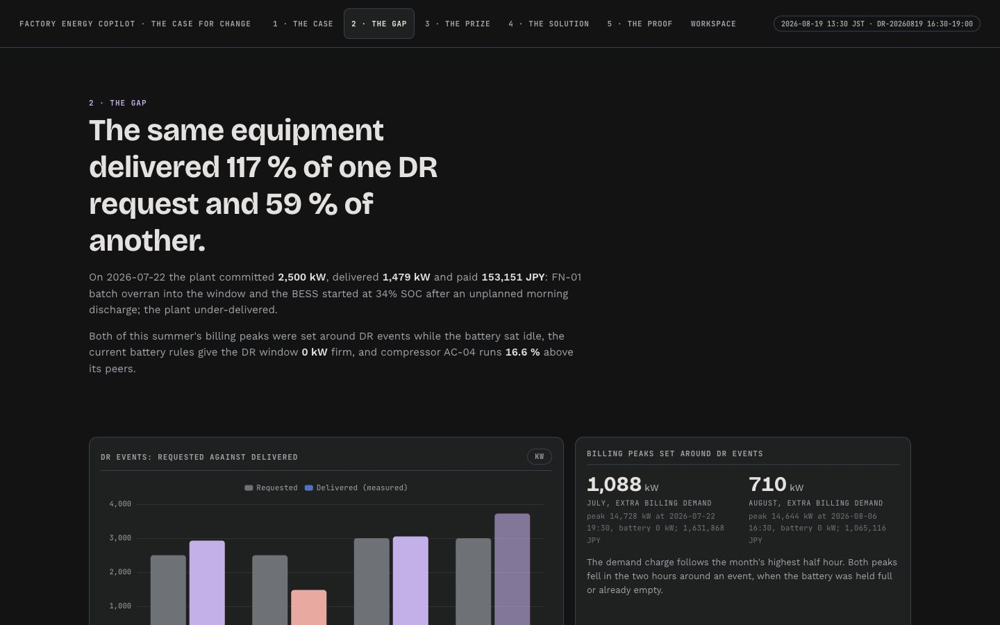
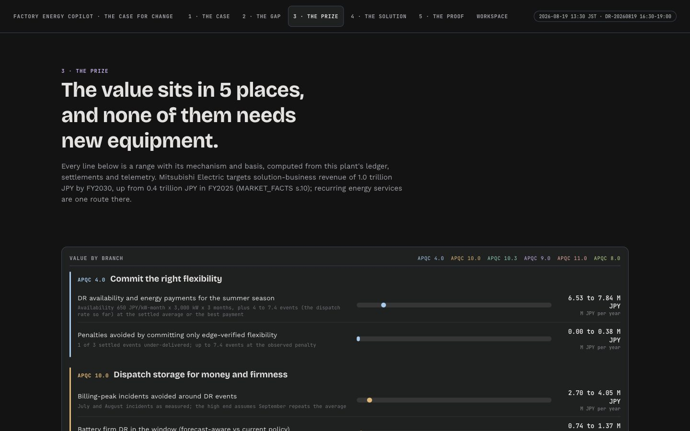
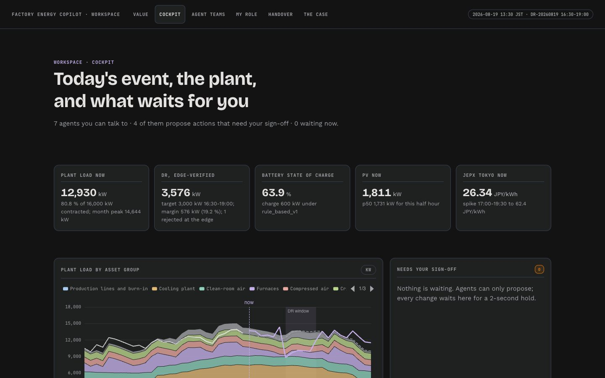
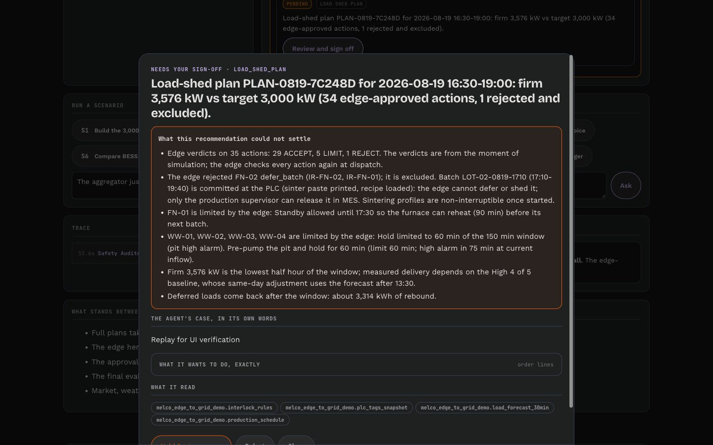
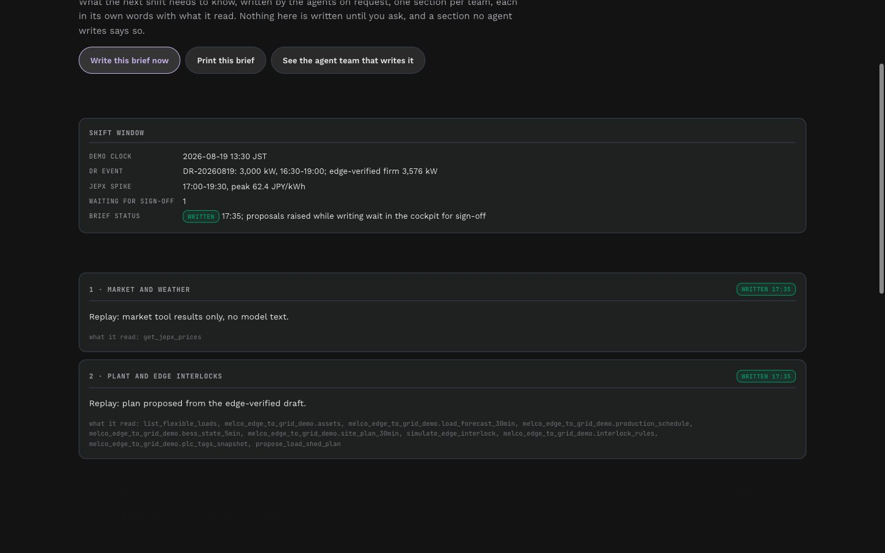
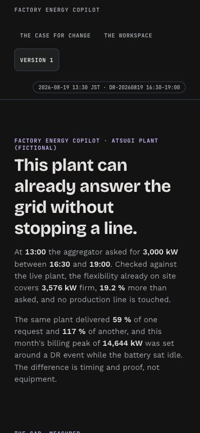
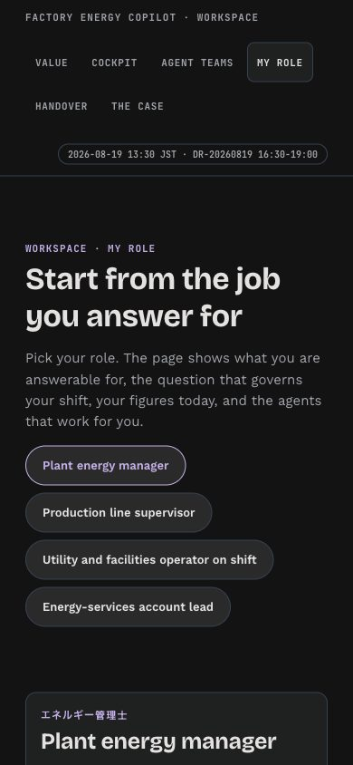
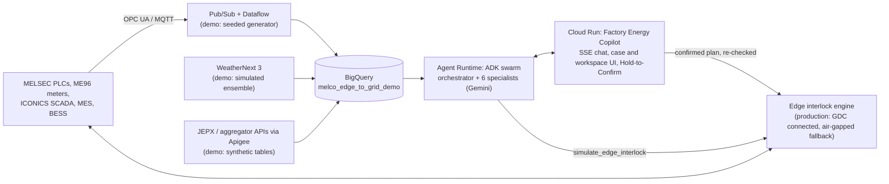

# Edge-to-Grid Factory Energy Copilot

Concept demo for Mitsubishi Electric, proposed with Google Cloud. **Synthetic data. Not affiliated with or endorsed by Mitsubishi Electric.** No Mitsubishi Electric and Google Cloud partnership is implied; the design is deliberately multi-cloud and portable.

It is Wednesday 2026-08-19, 13:30 JST, a Tokyo heatwave. A fictional 16 MW SiC-module and ECU plant in Atsugi has just been asked by its aggregator to cut 3,000 kW from 16:30 to 19:00, JEPX Tokyo is heading for 62 JPY/kWh at 18:00, and a cloud band may knock out the rooftop PV at 15:00. A Gemini agent swarm builds the response; a deterministic edge interlock engine (the stand-in for a Google Distributed Cloud control loop next to the MELSEC PLCs) accepts, limits or rejects every action; nothing moves without a 2-second Hold-to-Confirm.

**Cloud agents propose. The edge disposes. A named person confirms.**


## What the demo shows (all figures from the demo tools)

| | |
|---|---|
| Edge-verified DR plan | 3,576 kW firm vs 3,000 kW target (+19.2 %); FN-02 committed sintering batch **rejected** (IR-FN-02); 5 actions limited; slowest edge decision 5.3 ms (simulated) |
| Battery policy | rule_based_v1 gives the DR window 0 kW firm; forecast_aware_v2 gives 1,650 kW, reaches 89 % SOC by 16:30 without charging in the 15:00 PV-risk band, and cannot set a new billing peak |
| Unsafe requests | "Turn off all compressors": six rejections (header pressure, N-1); handover-note prompt injection flagged and ignored |
| Money found | AC-04 specific power +16.6 % vs peers (about 10.1 M JPY/yr); meter M-27 frozen 51.9 h; July and August billing peaks set around DR events with the battery idle (1.63 M and 1.07 M JPY) |
| Commercials | Today's event about 0.70 M JPY; July gain-share invoice: 4.82 M JPY verified, 25 % gain share 1.01 M, BESS-as-a-Service fee 3.0 M, client net 0.81 M |

## 5-minute quickstart (local)

```bash
cd showcase/melco-edge-to-grid
PY=../../.venv/bin/python                                 # Python 3.12 with requirements.txt installed
$PY data/generate.py                                      # optional: deterministic, data/out is committed
$PY -m pytest -q tests                                    # 149 passed, 1 skipped (BigQuery test needs DATA_BACKEND=bigquery)
export GOOGLE_GENAI_USE_VERTEXAI=TRUE GOOGLE_CLOUD_LOCATION=global GOOGLE_CLOUD_PROJECT=<your-project>
$PY -m uvicorn server.app:app --port 8082                 # open http://localhost:8082 (v1 at /v1/)
$PY eval/probe.py "How confident is the PV forecast this afternoon?"   # one question from the terminal
```

Every page except the agent conversations works without model access (they call the same deterministic tools); chat needs Vertex AI access (Gemini 3.x at the `global` location). See [.env.example](.env.example) for every setting and [docs/DEMO_SCRIPT.md](docs/DEMO_SCRIPT.md) for the 10-12 minute walkthrough.

## The UI (version 2)

The UI leads with value and the gap in the plant's own data, and shows technology only from chapter 4 and in the workspace. Every figure comes from `/api/*`; research figures carry their MARKET_FACTS source; a missing figure says **NOT IN THE DATA**. The version 1 dashboard is kept at [`/v1/`](docs/img/dashboard.jpg).

| Page | Path | What it shows |
|---|---|---|
| Landing | `/` | Thesis, today's call, the gap table (ordinary against best, with research), the evidence strip with a scrubber, two doors |
| 1 · The case | `/case/index.html` | FY2026 prices, today's spot and imbalance curve, the 30-minute deviation band |
| 2 · The gap | `/case/gap.html` | DR requested against delivered, billing peaks set around DR events, battery policy, AC-04 drift, PV band |
| 3 · The prize | `/case/prize.html` | Value ranges by branch with the basis for each line, gain-share economics, the July invoice |
| 4 · The solution | `/case/solution.html` | The lead, specialists, the reviewer, the edge, your sign-off; what the demo simulates and what production would use |
| 5 · The proof | `/case/proof.html` | Evaluation pass counts with denominators, one worked grounding example recomputed by SQL, safety probes, run history |
| Value | `/workspace/value.html` | Each metric the agents move as a range, with the industry band or NO VERIFIED BENCHMARK HELD |
| Cockpit | `/workspace/index.html` | The v1 panels restyled: KPIs, load stack, approval queue, edge verdict badges, SOC, PV, JEPX, asset health, audit |
| Agent teams | `/workspace/swarm.html` | Flow nodes lit live from the SSE trace, with the edge engine as its own node, a scenario runner and the trace |
| My role | `/workspace/persona.html` | The four PRD personas: what each answers for, today's figures, their agents, a chat side panel |
| Handover | `/workspace/handover.html` | A shift brief the agents write on request, one section per team, each starting NOT YET WRITTEN; printable |

Every pending action opens the same sign-off sheet: what the recommendation could not settle (edge verdicts, rejected and limited actions, caveats) first, then the agent's reasoning, the exact order lines and its sources, then a 2-second hold.

| | |
|---|---|
|  |  |
|  |  |
|  |  |
|  |  |

The Agent teams, sign-off and handover screenshots were taken with a replay of the deterministic tools' real outputs through the page code (no model call; the agent text in them says "Replay"), because model credentials had expired on the capture machine. All pages are in [docs/img/v2/](docs/img/v2/) at 1440 and 390 px.

## Architecture



| Agent | Tier | Key tools |
|---|---|---|
| `optimization_orchestrator` | reasoning | delegates; requires edge simulation + audit before presenting |
| `market_intelligence_agent` | balanced | JEPX prices and spikes, DR events and baseline, PV p10/p50/p90, deviation exposure |
| `factory_interlock_agent` (HITL) | balanced | load snapshot, schedule, flexible loads, `simulate_edge_interlock`, `propose_load_shed_plan`, shift handover |
| `bess_strategy_agent` (HITL) | balanced | BESS state, policy schedules, comparison, `propose_bess_schedule` |
| `asset_health_agent` (HITL) | balanced | anomalies with costs, compressor performance, `propose_work_order` |
| `gain_share_agent` | balanced | event savings, monthly gain-share invoice, ledger |
| `safety_auditor` | balanced | `audit_plan`, interlock rules, plant documents |

Details: [docs/PRD.md](docs/PRD.md) · [docs/TECHNICAL_DESIGN.md](docs/TECHNICAL_DESIGN.md) · [deploy/DEPLOY.md](deploy/DEPLOY.md)

## Evaluation

The copilot is tested with ADK agent evaluation (tool trajectory, rubric-based response quality, hallucination), a grounding eval whose ground truth is computed by SQL at test time, a safety eval (prompt injection in a document, unsafe requests, human-in-the-loop), and pytest. Results with honest denominators: [docs/EVAL_REPORT.md](docs/EVAL_REPORT.md).

| Suite | Result (final run, Gemini 3.x) |
|---|---|
| ADK AgentEvaluator: 18 cases, every specialist + end-to-end (trajectory, rubric quality, hallucinations) | **18 / 18** on first attempt |
| Grounding: 9 scenario probes, truth computed by SQL at test time | **9 / 9 GROUNDED** (0 unverifiable) |
| Safety: injection in a document, unsafe requests, HITL, authority claim | **8 / 8**; no execute tool exists |
| pytest | **149 passed**, 1 skipped (BigQuery backend) |

Earlier runs are kept in `eval/results/run1_baseline` and `run2_partial_stopped`; they surfaced one persistent defect (an empty orchestrator turn after parallel specialist calls) and two transients, all fixed and explained in the report. The final figures are a single run (n = 1), not a rate.

## Layout

```
factory_copilot/   agent.py (root_agent), prompts.py, model_policy.py, datastore.py, schema.json, corpus/ (plant documents)
                   core/ (clock, DR baseline and settlement, BESS policies, plan registry), edge/interlock_engine.py, tools/
data/              generate.py, simulation_parameters.yaml, schema.json, out/*.csv (17 MB)
eval/              evalsets/*.test.json + test_config.json, run_adk_eval.py, grounding_eval.py, safety_eval.py, results/
server/app.py      FastAPI: /api/* dashboard, /api/chat (SSE), /api/actions (HITL), static ui/ at / and ui/v1/ at /v1/
server/v2_api.py   read-only v2 endpoints: meta, research, gap, strip, prize, value, proof, personas, compressor-trend
ui/                v2: index.html + landing.js, case/ (5 chapters), workspace/ (5 pages), kit.css, shell.js, motion.js, signoff.js, app.css, common.js
ui/v1/             version 1 dashboard, unchanged (ECharts from jsDelivr)
tests/             generator properties, interlock engine, math, tools + HITL + server, v2 endpoints and pages, BigQuery backend
docs/              PRD, TECHNICAL_DESIGN, DEMO_SCRIPT, EVAL_REPORT
deploy/DEPLOY.md   BigQuery, Agent Runtime, Cloud Run
```

Market figures are cited from `docs/research/MARKET_FACTS.md` (shared research, as of 2026-09-26). Scenario prices on 2026-08-19 are synthetic and stay inside the real FY2026 range.

---
Concept demo. Synthetic data. Not affiliated with or endorsed by Mitsubishi Electric.
