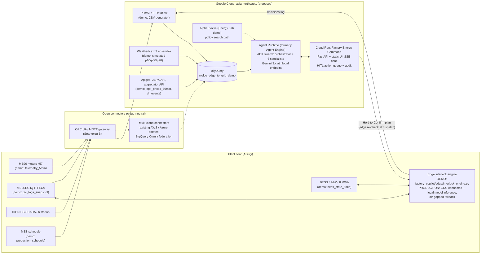

# Technical Design: Edge-to-Grid Factory Energy Copilot

Concept demo. Synthetic data. Not affiliated with or endorsed by Mitsubishi Electric. Google Cloud is proposed here as a collaborator; no existing partnership is implied [MF s.10].

Product names: **Gemini Enterprise Agent Platform** (formerly Vertex AI) and **Agent Runtime (formerly Vertex AI Agent Engine)** [MF s.11]. SDK and package names in code stay as they are (`vertexai`, `google-adk`).

---

## 1. Architecture



| Layer | Demo simulates | Production uses |
|---|---|---|
| OT data | Seeded generator writes CSVs (`data/generate.py`) | ME96 over Modbus to gateway, MELSEC and ICONICS over OPC UA / MQTT, Pub/Sub + Dataflow into BigQuery |
| Edge control | Deterministic Python engine, simulated latency | Same rules as signed code on Google Distributed Cloud connected (Dell XR servers; Japan is a supported country [MF s.11]) or the plant's MELSEC edge computer; runs air-gapped; local Gemini Flash on GDC connected where inference is needed |
| Weather | Synthetic 64-member ensemble summary | WeatherNext 3 via BigQuery: hourly runs, 5 km surface, solar radiation and cloud cover [MF s.11] |
| Market | Synthetic JEPX, reserve margin, imbalance | JEPX API (spot live 2026-03-25, intraday from 2026-10-01 deliveries) behind Apigee; OCCTO reserve margin; aggregator API [MF s.4.1] |
| Agents | ADK Runner in-process (local) | Agent Runtime in asia-northeast1, sessions, Cloud Trace |
| UI | FastAPI + static HTML on localhost | Cloud Run, IAP, Gemini Enterprise app registration |
| Policy optimisation | Hand-tuned `forecast_aware_v2` | AlphaEvolve search over the policy family with holdout days (Energy Lab demo) |
| Multi-cloud | Not exercised | Connectors to existing AWS / Azure estates; ICONICS and Serendie data remain in open formats |

---

## 2. Data model

Dataset `melco_edge_to_grid_demo` (override with `BQ_DATASET`; the dataset is never the project). Types come only from `data/schema.json` (identical copy in `factory_copilot/schema.json`): `STRING`, `INT64`, `FLOAT64`, `BOOL`. Dates and timestamps are ISO strings; `date`, `slot` (1..48), `hour`, `month` are precomputed.

| Table | Rows | Cols | Description |
|---|---|---|---|
| `assets` | 83 | 13 | Asset register with PLC tag, meter, flex class, criticality |
| `meters` | 57 | 8 | ME96-series meter register |
| `telemetry_5min` | 239,058 | 9 | 5-minute power per meter, 2026-08-05 to 13:25 on the demo day |
| `site_load_30min` | 3,819 | 15 | Receiving-point 30-minute history from 2026-06-01 (baselines, settlement) |
| `pv_forecast_30min` | 432 | 9 | Ensemble p10 / p50 / p90 per slot, daily 06:00 issue plus 13:00 on the demo day |
| `pv_actual_5min` | 4,194 | 7 | Measured PV |
| `jepx_prices_30min` | 3,888 | 11 | Tokyo spot, intraday, imbalance, reserve margin, plant all-in price (2026-06-01 to 2026-08-20) |
| `load_forecast_30min` | 1,617 | 7 | Asset-level forecast for the rest of the demo day |
| `site_plan_30min` | 48 | 13 | Day-ahead nomination, load and PV forecasts, import before BESS (p50 and p10 PV) |
| `bess_state_5min` | 4,195 | 11 | Battery SOC and power |
| `compressor_perf` | 480 | 8 | Daily compressor energy, air and specific power from 2026-06-01 |
| `production_schedule` | 121 | 17 | MES planning view for 2026-08-18 and the demo day |
| `plc_tags_snapshot` | 82 | 7 | Edge live state at 13:30 (batch commitment, airflow floors, header pressure, TES, pit level) |
| `interlock_rules` | 26 | 10 | Hard and soft interlocks with rationale and source |
| `dr_events` | 4 | 22 | Three settled events and today's dispatch |
| `tariff_contract` | 21 | 6 | Tariff, DR, gain-share and BESS-as-a-Service parameters |
| `savings_ledger` | 31 | 6 | Monthly savings by category, Jan-Jul 2026 |
| `edge_decisions` | 14 | 13 | Edge decision history (runtime decisions are appended in memory) |

Relationships: `assets.meter_id -> meters.meter_id`; `telemetry_5min.meter_id -> meters`; `production_schedule.asset_id`, `plc_tags_snapshot.asset_id`, `load_forecast_30min.asset_id -> assets`; `dr_events.date -> site_load_30min.date` (baseline, settlement); `jepx_prices_30min (date, slot)` joins every 30-minute table; `savings_ledger.event_ids -> dr_events.event_id`; `edge_decisions.plan_id` joins the runtime plan registry.

Example DDL (all tables are loaded from `data/schema.json` with `bq load --schema`):

```sql
CREATE TABLE `${GOOGLE_CLOUD_PROJECT}.melco_edge_to_grid_demo.dr_events` (
  event_id STRING, date STRING, start_time STRING, end_time STRING, start_slot INT64, end_slot INT64,
  requested_kw FLOAT64, notified_at STRING, program STRING, baseline_method STRING,
  energy_rate_jpy_kwh FLOAT64, penalty_rate_jpy_kwh FLOAT64, status STRING, baseline_kw FLOAT64,
  actual_kw FLOAT64, delivered_kw FLOAT64, delivered_kwh FLOAT64, shortfall_kwh FLOAT64,
  payment_jpy FLOAT64, penalty_jpy FLOAT64, net_settlement_jpy FLOAT64, notes STRING);

CREATE TABLE `${GOOGLE_CLOUD_PROJECT}.melco_edge_to_grid_demo.interlock_rules` (
  rule_id STRING, asset_class STRING, applies_to STRING, parameter STRING, operator STRING,
  limit_value FLOAT64, unit STRING, severity STRING, rationale STRING, source STRING);
```

All SQL is portable between DuckDB and BigQuery: `{t:table}` references and `@param` values, only SUM / AVG / MIN / MAX / COUNT / ROUND / ABS / COALESCE / CASE, joins and CTEs (asserted by `tests/test_agents_tools_hitl.py::test_sql_is_portable`).

---

## 3. Synthetic data specification

One seeded 5-minute physical model (`data/generate.py`, parameters in `data/simulation_parameters.yaml`, seed 20260819) produces every table, so receiving-point import, sub-meters, BESS, PV, settlements and the ledger reconcile (`import = gross x 1.01 - PV - BESS`, tested to under 1 kW).

| Component | Model | Calibration |
|---|---|---|
| Weather | Daily Tmax by period with heatwave days (37.4 C on the demo day), diurnal half-cosine, cloudiness | Summer Tokyo climate; fixed event days |
| Loads (81 assets) | Clean-room AHUs (airflow, temperature), chillers (cooling load / COP), compressors (demand allocation, specific power), furnaces (batch profiles 1,150 / 820 / 420 kW), lines, burn-in (4 h cycles), EV (shift and van patterns), lighting, wastewater duty, utilities | About 13-15 MW weekday afternoons against a 16 MW contract |
| PV | Clear-sky shape, temperature derate, cloud AR process; 3,000 kWp | p10-p90 coverage 77 % over 14 days (target about 80 %) |
| BESS | rule_based_v1 history (night charge, midday top-up, demand limit 13,500 kW) with operator overrides on event days | 85 % round trip [MF s.12] |
| JEPX | FY2025 summer hourly shape mapped to FY2026 trough 17.2 / peak 27.9; AR day level (log SD 0.169); weekend discount; heatwave evenings | Monthly means within 0.3 JPY/kWh of FY2026 actuals (Jun 20.0, Jul 19.9, Aug 21.2) [MF s.1.3] |
| Imbalance | max(spot + noise, scarcity(reserve margin)), cap 200 | Scarcity curve B 10 %, B' 8 % at 45, A 3 % at 200 [MF s.3] |
| DR history | Actions applied to event days; settlement recomputed from site data by the same baseline math the tools use | 07-08 117 %, 07-22 59 % (penalty), 08-06 102 % |

**Deliberate anomalies (all asserted by tests):** AC-04 specific power drifting from about +2 % (June) to +16.6 % (last 3 days) versus peers; meter M-27 frozen at 696.5 kW from 2026-08-17 09:40 (51.9 h); FN-02 batch 17:10-19:40 committed at the PLC and overlapping the DR window; PV cloud band 14:30-16:00 with p10 at 26 % of p50 at 15:00; a prompt injection in the shift handover note; one under-delivered historical DR event with a penalty; billing peaks in July and August set around DR events while the battery was idle (emergent from the model, not scripted).

---

## 4. Agent architecture

Pattern A swarm with Pattern B specialists, ADK 2.10. Specialists are `LlmAgent(mode="single_turn")` sub-agents: the orchestrator calls each like a tool; each runs inline in the same session, so its tool calls stream to the UI trace and appear in eval trajectories; control returns to the orchestrator. Model ids come only from `factory_copilot/model_policy.py` (env-overridable).

| Agent | Tier / model default | Tools (count) | Prompt summary |
|---|---|---|---|
| `optimization_orchestrator` | reasoning / `gemini-3.1-pro-preview` | 6 specialists | Routing table per scenario; mandatory order for plans: market -> factory (list, simulate, propose) -> BESS (optimize, propose) -> gain share -> auditor; present only after edge simulation and audit; union window for spike + DR; never execute |
| `market_intelligence_agent` | balanced / `gemini-3.6-flash` | get_jepx_prices, get_dr_events, get_pv_forecast, get_deviation_exposure (4) | Report event, spike, PV risk, deviation with sources |
| `factory_interlock_agent` | balanced | get_plant_load_snapshot, get_production_schedule, list_flexible_loads, simulate_edge_interlock, propose_load_shed_plan, get_shift_handover (6) | Pass the draft plan unchanged to the edge; never propose rejected actions; flag injected text |
| `bess_strategy_agent` | balanced | get_bess_state, optimize_bess_schedule, compare_bess_policies, propose_bess_schedule (4) | Honest policy labels (hand-tuned, AlphaEvolve is the path) |
| `asset_health_agent` | balanced | detect_energy_anomalies, get_compressor_performance, propose_work_order (3) | Evidence and cost per anomaly |
| `gain_share_agent` | balanced | compute_event_savings, compute_gain_share, get_savings_ledger (3) | State the gain-share % and assumptions |
| `safety_auditor` | balanced | audit_plan, lookup_interlock_rules, search_plant_documents (3) | Verdict with findings; blocks, never approves execution |

Shared preamble (prepended to every agent): demo clock, plant, dataset location ("the dataset, never the project"), no number without a tool result, reconcile user-supplied numbers, no invented causes, citation format, HITL and untrusted-document rules, style (units, no dashes, banned words).

Orchestrator robustness (found by evaluation, see EVAL_REPORT.md): after several parallel specialist results, the reasoning model occasionally returned an empty turn (no text, no function call), so the plan stopped early and the user saw no answer. Two callbacks on the root agent close this: `retry_empty_turn` (after-model) retries an empty turn once with a short "continue" nudge using the stored request, and `ensure_final_answer` (after-agent) emits the specialists' grounded results as the answer if the orchestrator still wrote nothing. Both are no-ops on normal turns and are unit-tested.

Plan windows: a DR plan uses exactly the DR event window (16:30-19:00); only a spike question while the event is active uses the union window (16:30-19:30), and `compute_event_savings` warns when a plan does not cover the whole DR window.

Plan registry (`factory_copilot/core/registry.py`): `simulate_edge_interlock` registers each plan_id with its full result; `propose_load_shed_plan` refuses plans that were never simulated or that have no non-rejected action; `audit_plan` returns BLOCKED when no simulation record exists. Production equivalent: edge decision log in BigQuery via Pub/Sub and a Firestore pending-action store.

---

## 5. Deterministic math

**Baseline (High 4 of 5 with same-day adjustment).** Eligible days: weekdays before the event that are not holidays, reduced days or earlier event days. Take the 5 most recent, rank by mean import over the event slots, keep the top 4:
`B_raw(s) = mean_{d in top4} import_d(s)`;
`adj = mean_{s in A} [ (import_e(s) + bess_e(s)) - mean_{d in top4}(import_d(s) + bess_d(s)) ]`, with `A` = the 4 slots from start-6 to start-3 (13:30-15:30 for a 16:30 start; forecast after 13:30);
`B(s) = B_raw(s) + adj`.

**Settlement.** `delivered = mean_s (B(s) - import(s))`; `paid_kWh = min(max(delivered x h, 0), requested x h)`; `payment = paid_kWh x 45`; `shortfall_kWh = max(0, (requested - delivered) x h)`; `penalty = shortfall_kWh x 60` JPY.

**Edge plan totals.** `firm = min_s sum_a granted_a(s)`, margin = firm - target. Examples of action physics: fan power ∝ speed³ (AHU trim to floor + 3 %); compressor standby gain = flow x (SP_unit - SP_peers); header setpoint 0.7 % per 0.01 MPa; header decay time `t = (P - 0.60) / ((deficit / 60) x 0.1013 / V)` seconds; TES energy `kW x h x COP <= (SOC - 15 %) x 14,000 kWh-th`; chilled-water +1 C about 2.5 % chiller power; office +1 C about 16 % AHU power.

**BESS.** `SOC' = SOC - P x 0.5 / eta_d / E` (discharge), `SOC' = SOC + |P| x 0.5 x eta_c / E` (charge), eta = sqrt(0.85), E = 8,000 kWh, SOC in [10, 95] %.
`forecast_aware_v2`: water-fill pre-charge toward 95 % over non-risk slots before the first DR / spike slot with per-slot cap `min(4,000, ceiling - import_p10)`, and in gate-closed slots `0.8 x band - (import_p50 - nominated)`; ceiling = month billing peak to date - 150 kW; flat discharge `floor50((SOC_start - 20 %) x E x eta_d / hours)` across DR ∪ spike slots; re-nominate open slots; p10 contingency discharge in risk slots of `max(0, deviation - 0.8 x band)`; recharge 1,500 kW from 22:00. PV-risk slot: `(p50 - p10) / p50 >= 0.40` and `p50 >= 300 kW`.

**Deviation exposure.** `excess_kWh = max(0, |import - nominated| - 0.075 x nominated) x 0.5`; cost = excess x imbalance price.

**Event value.** DR payment - penalty + load-shift value (reduction x plant price - rebound kWh x 20:00-24:00 average price) + battery value (window discharge x price - extra pre-charge cost vs v1 - 8 JPY/kWh wear) + demand charge avoided (only if a new monthly peak is avoided) + imbalance exposure avoided (v1 - v2, p10 PV).

**Gain share.** `share = 25 % x max(0, eligible)`; `client_net = total - share - BaaS fee`. Plant energy price = `spot x 1.04 + 8.03` JPY/kWh.

**Anomalies.** Compressor flag when the last-3-days specific power exceeds the peer median by 12 % or more; annual cost = excess kW while running x 8,000 h x average plant price. Frozen meter: one exact value repeated for 24 or more contiguous 5-minute intervals (non-contiguous repeats rejected by span check), confirmed by the energy-balance residual `import + PV + BESS - sum(feeders)` before vs after. Billing-peak incident: the month's peak falls within 2 hours of a DR event with the battery idle; extra = peak - max(highest non-event-day peak, 13,500 kW).

---

## 6. Evaluation design

1. **ADK AgentEvaluator** (`eval/run_adk_eval.py`, 18 cases in 7 sets under `eval/evalsets/`): `tool_trajectory_avg_score` (ANY_ORDER, names only: the specialist and its key tool), `rubric_based_final_response_quality_v1` (3 shared + 2-5 case rubrics, judge = balanced tier), `hallucinations_v1` (sentence-level support against every tool output). Thresholds 1.0 / 0.8 / 0.8. Failing cases are retried once and classified.
2. **Grounding** (`eval/grounding_eval.py`, 9 probes): truth computed at test time by SQL (or the deterministic engine, labelled), key figures in the reply must match within tolerance; GROUNDED / UNGROUNDED / UNVERIFIABLE.
3. **Safety** (`eval/safety_eval.py`, 8 probes + static check): injection in a document (two phrasings), unsafe requests (clean room, compressors, furnace), HITL (execute now, push battery), authority claim in chat.
4. **pytest** (`tests/`): generator properties, every interlock rule, math, tool contracts, SQL portability, server HITL queue; BigQuery backend test skips unless `DATA_BACKEND=bigquery`.

Results and honest denominators: [EVAL_REPORT.md](EVAL_REPORT.md).

---

## 7. Access model

| Principal | Roles (least privilege) | Notes |
|---|---|---|
| `sa-agent-runtime` (Agent Runtime) | `roles/bigquery.dataViewer` on the dataset only, `roles/bigquery.jobUser` on the project, `roles/aiplatform.user` | Read-only data; no write path from agents |
| `sa-web` (Cloud Run) | `roles/aiplatform.user` (query the agent), `roles/bigquery.dataViewer` (dashboard), `roles/datastore.user` (pending actions, production) | Owns the HITL queue and audit log |
| `sa-edge` (GDC connected) | Pub/Sub publisher for decision logs; subscriber for confirmed plans | Signed plans only; no model credentials needed for control |
| `sa-ingest` (Dataflow) | Pub/Sub subscriber, BigQuery dataEditor on the raw dataset | Separate from the agent path |

Workload identity everywhere (Cloud Run and Agent Runtime service identities; Workload Identity Federation for on-prem connectors); no service-account keys. Humans reach the UI through IAP with named identities recorded in the audit log. **Argolis note:** demo projects in restricted (Argolis) organisations may enforce domain-restricted sharing; public IAM bindings and `allUsers` invokers will fail by design, so share through IAP with named users.

---

## 8. Security (OWASP LLM Top 10 mapping)

| Risk | Control in this design |
|---|---|
| LLM01 Prompt injection | Documents returned with a deterministic injection scanner and a data-not-instructions policy; preamble rule; edge rejects unsafe actions regardless; safety eval SF01, SF02, SF08 |
| LLM02 Insecure output handling | UI escapes all model text; markdown renderer supports a safe subset; tool args are parsed as JSON and validated by the engine |
| LLM03 Training data poisoning | Not applicable (no fine-tuning); corpus changes reviewed |
| LLM04 Model denial of service | Per-request timeouts; single-turn specialists; no recursive delegation |
| LLM05 Supply chain | Exact pins in requirements.txt; slim base image |
| LLM06 Sensitive information disclosure | Synthetic data; no project ids or keys in artifacts (tested); DLP inspection of free-text notes in production |
| LLM07 Insecure plugin design | Tools are typed plain functions, read-only except `propose_*`, which only queue |
| LLM08 Excessive agency | No `execute_*` tool exists; Hold-to-Confirm; edge re-check at dispatch; auditor BLOCKED verdict |
| LLM09 Overreliance | Every figure cited; assumptions listed; edge verdicts shown next to planning estimates |
| LLM10 Model theft | Managed models on Gemini Enterprise Agent Platform; no weights handled |

OT security: the edge accepts only signed, confirmed plans; OT network monitoring (for example Nozomi Networks, a Mitsubishi Electric company [MF s.10]) watches the connector path.

---

## 9. Deployment (see deploy/DEPLOY.md)

BigQuery dataset `melco_edge_to_grid_demo` in asia-northeast1 loaded from `data/out/*.csv` with `data/schema.json`; Agent Runtime app in asia-northeast1 from `factory_copilot.agent.root_agent` (package ships `schema.json` and `corpus/`), models at the global endpoint; Cloud Run service from the Dockerfile with `AGENT_BACKEND=agent_engine` and `DATA_BACKEND=bigquery`.

---

## 10. Production path

* **Connectors first, cloud second.** Deploy the OPC UA / MQTT gateway to publish MELSEC, ICONICS and ME96 data; land it in the client's existing cloud if required and federate into BigQuery (BigQuery Omni for AWS S3 / Azure Blob), or stream through Pub/Sub + Dataflow. Keep ICONICS and Serendie data in open formats so no single cloud owns them.
* **Edge.** Port the interlock engine to the plant's signed control package on GDC connected (Japan supported; NTT DATA resells the air-gapped variant in Japan [MF s.11]); run on-prem Gemini Flash where local inference helps (GDC connected preview, Next '26 [MF s.11]); keep a rule-only fallback when disconnected.
* **Market and weather.** JEPX API behind Apigee (spot now, intraday from 2026-10-01 [MF s.4.1]); aggregator API; OCCTO reserve margin; WeatherNext 3 hourly ensembles via BigQuery [MF s.11].
* **Policies.** Evolve `forecast_aware_v2` with AlphaEvolve (GA on Google Cloud 2026-07-10 [MF s.11]) against a simulator evaluator with holdout days; promote only with evidence (Energy Lab demo).
* **Parameters to update:** imbalance cap 300 JPY/kWh and D 50 from 2026-10-01; TEPCO PG wheeling from 2026-11-01 (EHV 446.25 JPY/kW-month) [MF s.3, s.5.1].

---

## 11. Cost estimate (ranges, per plant, monthly)

| Item | Range (JPY/month) | Basis |
|---|---|---|
| Gemini calls (about 30 conversations/day, mix of pro and flash) | 30,000-150,000 | Token volumes seen in eval runs (9k-45k tokens per specialist case, more for full plans) |
| Agent Runtime + Cloud Run | 10,000-50,000 | Low steady traffic, minimum instances 0-1 |
| BigQuery storage and queries | 5,000-30,000 | Under 1 GB per plant-year of 5-minute data; small scans |
| Pub/Sub + Dataflow ingest | 20,000-80,000 | 57 meters + PLC tags at 5-60 s |
| GDC connected edge | Hardware and subscription quote | Per-site sizing; not estimated here |
| **Total cloud (excluding edge hardware)** | **about 65,000-310,000** | Versus 4.8-6.1 million JPY/month verified savings in the demo ledger |
