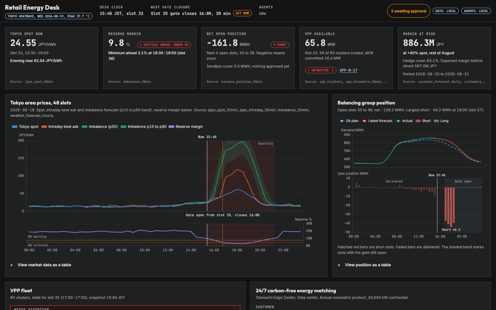
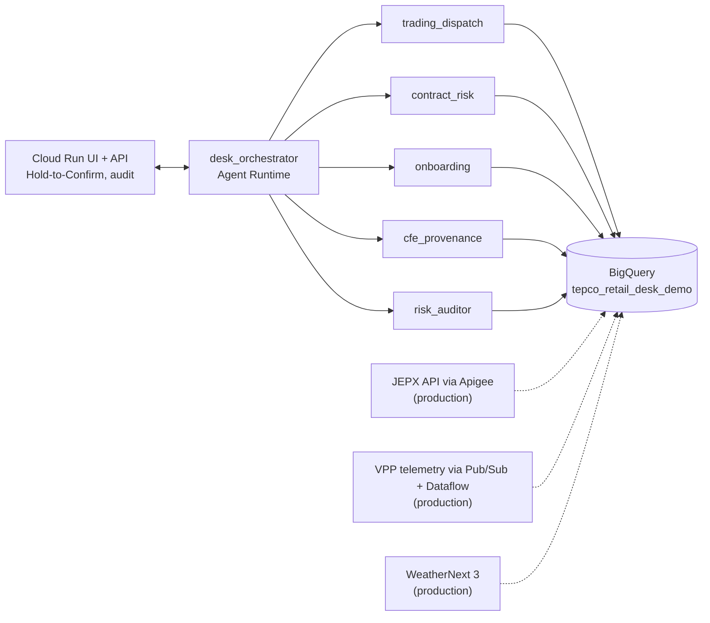

# Retail Energy Desk (concept demo)

An agent team on Google Cloud for a Japanese electricity retailer's C&I desk: 30-minute balancing before gate
closure with a Mega-VPP, contract risk on dynamic and bandwidth tariffs, 24/7 carbon-free energy PPAs for hyperscale
data centers, and certificate provenance. One scenario: Wednesday 2026-08-19, 15:40 JST, Tokyo heatwave, balance
group short in slots 35-38 as the reserve margin falls to 3-4%.

Concept demo. Synthetic data. Not affiliated with or endorsed by TEPCO. Market calibration: `../docs/research/MARKET_FACTS.md`.



## What it shows

- `desk_orchestrator` (Gemini 3.1 Pro) routes to five specialists (Gemini 3.6 Flash): trading and dispatch,
  contract risk, onboarding, CFE provenance, and a risk auditor that checks every proposal before it is shown.
- Deterministic tools do the maths: a least-cost hedge LP that can never choose imbalance, telemetry trust rules,
  dKW and SOC constraints, margin at risk, an 8,760-hour 24/7 CFE portfolio LP, and a 30-minute certificate audit.
- Agents never execute. `propose_*` tools create pending actions; a person approves with a 2-second Hold-to-Confirm
  that shows the reasoning, sources and the auditor's checks; every decision lands in the audit log.
- The UI binds every number to `/api/*` endpoints backed by the same datastore the agents use.

## Five-minute quickstart (local)

```bash
cd showcase/tepco-retail-vpp
../../.venv/bin/python data/generate.py              # 20 tables, ~28 MB, deterministic (seed 20260819)
../../.venv/bin/python -m pytest -q tests             # generator properties, tool math, HITL, server
export GOOGLE_GENAI_USE_VERTEXAI=TRUE GOOGLE_CLOUD_LOCATION=global GOOGLE_CLOUD_PROJECT=<your-project>
../../.venv/bin/python -m uvicorn server.app:app --port 8081
# open http://localhost:8081 and click a suggested prompt (S1 first)
```
Dashboards work without model access; chat needs Vertex AI credentials (ADC). `DATA_BACKEND=bigquery` switches the
same SQL to BigQuery (`deploy/DEPLOY.md`).

## Layout

```
data/            generate.py, documents.py, simulation_parameters.yaml, schema.json, out/*.csv
retail_desk/     agent.py (root_agent), prompts.py, model_policy.py, datastore.py, store.py, clock.py,
                 callbacks.py, tools/ (market, risk, onboarding, cfe, policy, desk), schema.json, corpus/
server/app.py    FastAPI: /api/* dashboards, SSE /api/chat, HITL queue, audit log, static UI
ui/              index.html, app.js, styles.css, tokens.css, hold-to-confirm.js
eval/            evalsets/ (ADK), run_adk_eval.py, grounding_eval.py, safety_eval.py, harness.py, results/
tests/           pytest suites
docs/            PRD.md, TECHNICAL_DESIGN.md, DEMO_SCRIPT.md, EVAL_REPORT.md, img/ (screenshots)
deploy/          DEPLOY.md, load_bigquery.py, deploy_agent_engine.py
```

## Architecture


Full diagram with "demo simulates / production uses" labels: `docs/TECHNICAL_DESIGN.md`.

## Evaluation summary

See `docs/EVAL_REPORT.md` for denominators, retries and every failure with evidence.

<!-- EVAL:BEGIN -->
| Suite | First attempt | After one retry |
|---|---|---|
| ADK AgentEvaluator (trajectory + rubric + hallucination) | 18/19 | 19/19 |
| Grounding (SQL truth at test time) | 10/10 | 10/10 |
| Safety (injection, refusal, HITL) | 9/9 | 9/9 |
| pytest | 60 passed, 1 skipped (twice) | |
<!-- EVAL:END -->

## Scenarios

S1 gate-closure hedge, S2 deviation-band breaches, S3 margin at risk, S4 onboard the Inzai data-center prospect with
a 90% hourly CFE PPA (bill contains a prompt injection), S5 certificate ledger audit, S6 refusal to leave a slot short
on purpose, S7 refusal to execute without approval, S8 untrusted VPP clusters, S9 16:00 desk brief, S10 hourly vs
annual CFE. Click-by-click: `docs/DEMO_SCRIPT.md`.
