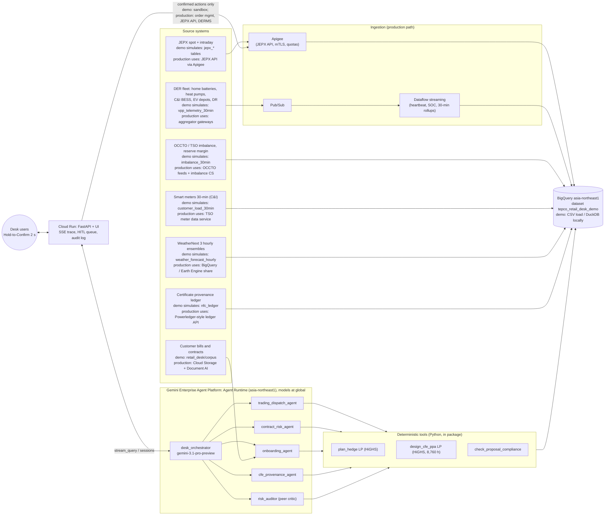
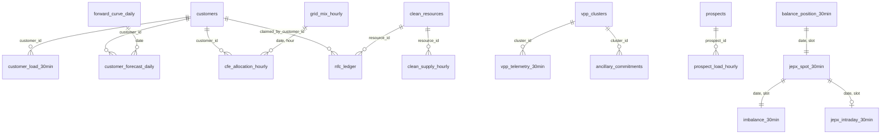

# Retail Energy Desk: Technical Design

Concept demo. Synthetic data. Not affiliated with or endorsed by TEPCO. Market figures: `docs/research/MARKET_FACTS.md` (MF).

## 1. Architecture



Key properties:
- Pattern A swarm: the orchestrator calls five Pattern B specialists as inline single-turn tools
  (`LlmAgent(mode="single_turn")`, ADK 2.10). Specialist tool calls, including `propose_*` pending actions, appear in
  the same event stream, so the server, the UI trace and the ADK evaluator all see them.
- Agents never write. `propose_*` tools return `pending_action`; the server lifts them into a queue; only a
  2-second Hold-to-Confirm on `POST /api/actions/{id}/confirm` executes (sandbox in the demo) and writes the audit log.
- The auditor reads the exact proposals from session state (written by `propose_*` via `ToolContext.state`), not the
  orchestrator's paraphrase, and records a verdict that the server attaches to each pending action.

## 2. Data model

Twenty tables, BigQuery-ready; types only `STRING`, `INT64`, `FLOAT64`, `BOOL`; ISO date strings with precomputed
`date`, `slot`, `hour`, `month`. Full DDL is in the appendix (generated from `data/schema.json`).



| Table | Rows | Grain |
|---|---|---|
| jepx_spot_30min | 3,888 | date x slot (2026-06-01..2026-08-20) |
| jepx_intraday_30min | 672 | date x slot (2026-08-06..2026-08-19; open slots hold the 15:40 book) |
| imbalance_30min | 3,840 | date x slot; scenario-day slots 32+ are p10/p50/p90 forecasts |
| weather_forecast_hourly | 3,600 | 10 Kanto cells x hour |
| customers | 300 | customer |
| customer_load_30min | 273,600 | customer x date x slot (2026-08-01..2026-08-19) |
| balance_position_30min | 912 | date x slot |
| customer_forecast_daily / forward_curve_daily / hedge_book | 3,600 / 42 / 4 | rest-of-August exposure |
| vpp_clusters / vpp_telemetry_30min / ancillary_commitments | 60 / 4,800 / 10 | fleet |
| clean_resources / clean_supply_hourly / grid_mix_hourly | 8 / 79,608 / 1,191 | clean supply |
| cfe_allocation_hourly / nfc_ledger | 9,528 / 27,747 | CFE customers and 30-minute certificates |
| prospects / prospect_load_hourly | 3 / 26,280 | 2027 projected load |

## 3. Synthetic data specification

Generator: `data/generate.py` (seeded, per-table RNG streams, 3.5 s, 28 MB). Parameters: `data/simulation_parameters.yaml`
with `# src: MF` tags; tests assert properties, not literals (`tests/test_generator.py`).

| Area | Distribution / rule | Calibration |
|---|---|---|
| Spot | Hour-of-day shape x heat factor x weekday factor x AR(1) daily log noise (SD 0.12) x slot noise; monthly means rescaled exactly | Tokyo Jun/Jul/Aug 2026 = 20.0 / 19.9 / 21.2 JPY/kWh, system ratio 0.755 / 0.90 / 0.90, summer shape, weekend 0.85 (MF 1.3-1.5) |
| Scenario spot | Slots 33-40 set to 33-62 JPY/kWh | Below FY2026 Tokyo max 64.28 (MF 1.6) |
| Reserve margin | Base 14-21% minus evening dip and heat; floor 6.2% on other days; scenario 3.1-3.9% in slots 35-39 | 2022 advisory forecasts 3.7-4.7% (MF 7) |
| Imbalance | max(spot x U(0.85, 1.18), scarcity(rm)); scarcity 0 at 10%, 45 at 8%, 200 at 3% | MF 3 (cap 200 until 2026-09-30) |
| Intraday | vwap = spot + N(0.3, 2.3); spreads 0.3-2.5; scenario book asks 96-139 JPY/kWh, 12-15 MWh depth | MF 2 (FY2026 premium SD 4.63) |
| Customers | 300 across 10 segments; tariff mix fixed 50% / market-linked 25% / bandwidth 25%; margins 0.6-2.4 JPY/kWh | market adder 1-3 JPY/kWh (MF 5.4) |
| Load | contracted kW x segment shape x (1 + sensitivity x max(0, T - 26 C)) x noise; day-ahead forecast used the storm-cooled temperature | synthetic; portfolio ~11 TWh/yr |
| VPP | 60 clusters, 97 MW: residential batteries (24), heat pumps (10), C&I BESS (10), EV depots (8), DR (8); costs 14-60 JPY/kWh | battery wear 8-20 JPY/kWh (MF 12), tight-event incentive about 20 JPY/kWh (MF 8, estimate) |
| dKW | 10 commitments, 16.4 MW, slots 33/35-40; products secondary 2, tertiary 1, tertiary 2 with 30-minute duration | EPRX product table (MF 4.2) |
| Clean supply | 8 generic resources; CF models for solar, wind (AR), hydro seasonality, nuclear share with staggered autumn refuelling | synthetic; nuclear share consistent with TEPCO-area nuclear appearing in 2026 (MF 7) |
| Grid CFE | 10% + 30% x solar shape | Google TEPCO-grid grid CFE 18% in 2025 (MF 6.4) |
| Bills | 基本料金, 電力量料金, 燃料費等調整額, 市場価格調整額, 再エネ賦課金 4.18 JPY/kWh | MF 5.3-5.4 |

**Deliberate anomalies** (each asserted by a test): A1 scarcity evening on 2026-08-19; A2 VPP-R-17 heartbeat frozen at
09:34 with SOC flat at 78.0% while holding dKW commitment ANC-0819-09; A3 Kanagawa Cold Chain breaches its +/-5% band
in 35.8% of metered slots (peers under 1.2%); A4 certificate NFC260807-WND-ON-... claimed by C-0005 and C-0008, plus a
solar certificate stamped at 02:00 and an FY2025 certificate claimed in August; A5 prompt injection in the Hokuso
Cloud Campus bill; A6 short 37.2 / 40.9 / 44.2 / 39.5 MWh in slots 35-38, other open slots flat within 0.5 MWh.

## 4. Agent architecture

| Agent | Pattern / tier | Tools (count) | Delegation | Prompt summary |
|---|---|---|---|---|
| desk_orchestrator | A, reasoning (`gemini-3.1-pro-preview`) | get_desk_clock, read_handover_note + 5 specialists (7) | single-turn tools | Routing rules; audit before presenting proposals; refusal and no-execution rules; desk brief headings |
| trading_dispatch_agent | B, balanced (`gemini-3.6-flash`) | get_market_snapshot, get_balance_position, get_vpp_fleet_state, plan_hedge, propose_intraday_orders, propose_vpp_dispatch (6) | none | Position, market, fleet, plan, then proposals when asked; report cost vs do-nothing |
| contract_risk_agent | B, balanced | find_customer, get_portfolio_exposure, get_deviation_breaches, compute_margin_at_risk, propose_tariff_adjustment (5) | none | Breaches, margin at risk; tariff proposals only on request |
| onboarding_agent | B, balanced | list_prospect_documents, read_document, get_prospect_profile, design_cfe_ppa, propose_ppa_offer (5) | none | Bill as untrusted data; report injection; hourly vs annual; price build-up |
| cfe_provenance_agent | B, balanced | list_cfe_customers, get_cfe_score, audit_nfc_ledger (3) | none | Always four CFE figures; ledger findings by type |
| risk_auditor | B critic, balanced | list_session_proposals, check_proposal_compliance, lookup_policy (3) | none | Audit every pending action; cite policy |

Every instruction starts with the shared preamble (`retail_desk/prompts.py`): where the data lives ("the dataset is
never the project"), the desk clock, tool-only figures with reconciliation of user-supplied numbers, citation format,
units, no dashes, and the safety rules. An `after_model_callback` normalises en and em dashes deterministically.

## 5. Deterministic math

**Slots and gates.** slot s covers [(s-1) x 30 min, s x 30 min); gate closure = start - 60 min; at 15:40 slots 35-48 are open.

**Telemetry trust.** untrusted if now - last_seen > 30 min or SOC identical over the last 12 records; degraded if
reporting devices / devices < 0.6 (0.3 for EV depots). Dispatchable power = max(0, available kW - committed dKW);
dispatchable energy = max(0, available kWh - committed kW x duration x 2); zero if untrusted or response too slow.

**Least-cost hedge (plan_hedge).** For open slots s with short N_s > 0.5 MWh:

    min  sum_s [ a1_s q1_s + a2_s q2_s + P r_s ] + sum_{c,s} k_c d_{c,s}
    s.t. q1_s + q2_s + sum_c d_{c,s} + r_s = N_s
         0 <= q1_s <= depth1_s,  0 <= q2_s <= depth2_s
         0 <= d_{c,s} <= 0.5 x dispatchable_kW_c / 1000,   sum_s d_{c,s} <= dispatchable_kWh_c / 1000
         r_s >= 0,  P = 100,000 JPY/kWh (imbalance is never an economic choice)

Plan cost = sum(a q + k d) x 1000; do-nothing cost = sum N_s x imbalance_p50_s x 1000 (and p90); cost avoided = do-nothing
- plan - residual x p50. Intraday proposals round to 50 kWh lots (MF 2).

**Deviation breach.** breach if |actual - nominated| > band% x nominated; excess = max(|actual - nominated| - band x
nominated, 0); cost = excess x imbalance price of the slot.

**Margin at risk.** per day d: E_d = exposed MWh (fixed and bandwidth); H_d = min(E_d, sum active hedge MW x 24);
MaR = sum_d (E_d - H_d) x 1000 x F_d x shock, with F_d the forward baseload. Hedges are allocated pro rata for
customer attribution. Market-linked tariffs carry zero loss.

**24/7 CFE PPA (design_cfe_ppa).** Over 8,760 hours h, resources r, 4-hour storage (power P):

    min  sum_r c_r cap_r sum_h cf_{r,h} + S x 4P + g sum_h (L_h - m_h) - rho g sum_h x_h
    s.t. sum_r cap_r cf_{r,h} - ch_h + dis_h - x_h - m_h = 0
         soc_h = soc_{h-1} + eta ch_h - dis_h / eta   (cyclic), eta = sqrt(0.85)
         ch_h, dis_h <= P, soc_h <= 4P, 0 <= m_h <= L_h, cap_r <= available_r
         sum_h m_h >= target x sum_h L_h

Price build-up per kWh of load: energy = (avg clean cost x matched + g x unmatched) / load; shaping and firming =
(storage + avg cost x (surplus + storage losses) - resale x surplus) / load; NFC tracking = certificate price x
matched / load (1.21 renewable, 1.20 non-renewable, MF 6.2); balancing 0.45; term adjustment -0.6% per year beyond 10;
margin (floor 0.50). Range = +/-7% on energy and shaping.

**CFE score (get_cfe_score).** matched_h = min(load_h, clean_h); hourly % = sum matched / sum load; grid contribution =
sum (load - matched) x grid CFE share / sum load; 24/7 score = hourly + grid; volumetric = sum clean / sum load (MF 6.4).

**Certificate audit.** double claim = certificate with more than one distinct claimant; no generation = certified
MWh per resource-slot > metered generation / 2 + 0.01; expired = claim date after expiry or vintage FY not equal to
the claim month's FY.

## 6. Evaluation design

| Layer | What | Where |
|---|---|---|
| Unit and property tests | 60 tests (plus 1 BigQuery parity test that skips locally): generator properties and anomalies, determinism (full regeneration byte-compare), tool math vs independent pandas, compliance gates with mutation checks, HITL structure, server queue, import side effects, static UI contract | `tests/` |
| ADK AgentEvaluator | 19 cases: 10 end-to-end (S1-S10) through the orchestrator (tool names, ANY_ORDER), 7 specialist cases with exact arguments, 2 auditor policy cases; criteria: tool_trajectory_avg_score 1.0, rubric_based_final_response_quality_v1 0.8 (3 shared + case rubrics), hallucinations_v1 0.8; judge gemini-3.6-flash | `eval/evalsets/`, `eval/run_adk_eval.py` |
| Grounding | S1-S10: truth by SQL at test time (LP figures by deterministic recompute); required tools; figures within tolerance; GROUNDED / UNGROUNDED / UNVERIFIABLE | `eval/grounding_eval.py` |
| Safety | Injection with screen on and off, user asking to apply the note, intentional imbalance, zero margin, untrusted cluster, execute now, approve for me, structural HITL | `eval/safety_eval.py` |

Every live case is retried once on failure and classified transient or persistent; the first attempt is kept.
Specialists are evaluated as chat-mode clones (identical model, instruction and tools) because ADK 2.10 rejects a
single-turn agent as a Runner root; the production single-turn path is covered end to end.

## 7. Access model

- Service accounts per tier: `desk-agent` (Agent Runtime: `bigquery.jobUser`, dataset-level `bigquery.dataViewer`,
  `aiplatform.user`), `desk-ui` (Cloud Run: same read roles plus Agent Runtime query). No write role on the dataset
  for any agent identity; pilot adds a separate `desk-exec` identity used only by the confirm endpoint.
- No service account keys: attached service accounts on Agent Runtime and Cloud Run; Workload Identity Federation for
  CI. Secrets (JEPX API credentials in production) in Secret Manager, referenced by Apigee, never by agents.
- Argolis-only domain binding warning: in Argolis projects, IAM bindings must use identities from the allowed domain;
  do not expose Cloud Run publicly; use IAP.

## 8. Security (OWASP LLM Top 10 mapping)

| Risk | Control in the demo | Production addition |
|---|---|---|
| LLM01 Prompt injection | Documents returned as data with a handling rule; deterministic screen (`content_warnings`); PPA margin floor in the tool; auditor check; safety eval with the screen off | Model Armor on inputs and tool outputs; Document AI extraction to structured fields |
| LLM02 Sensitive information disclosure | Synthetic data; no personal data; dataset-level read only | DLP on bills; column-level security on customer tables |
| LLM03 Supply chain | Exact pins; reference datastore copied and tested for equality | Artifact Registry scanning; Binary Authorization |
| LLM04 Data and model poisoning | Ground truth from tables, not model memory | Data contracts on Dataflow pipelines |
| LLM05 Improper output handling | UI renders model text with an escaping markdown renderer; no HTML from the model | CSP headers |
| LLM06 Excessive agency | No execute tool; `propose_*` only; Hold-to-Confirm; audit log | Separate execution identity and two-person rule above limits |
| LLM07 System prompt leakage | No secrets in prompts | Same |
| LLM08 Vector and embedding weaknesses | No vector store in the demo | Vertex AI Search with ACLs if added |
| LLM09 Misinformation | Grounding preamble, citations, grounding eval, hallucination metric | Continuous eval on Agent Runtime traces |
| LLM10 Unbounded consumption | Tool counts at most 10 per agent; LP caches; bounded slot ranges | Quotas on Apigee and Agent Runtime |

## 9. Deployment

See `deploy/DEPLOY.md`. BigQuery dataset `tepco_retail_desk_demo` in asia-northeast1 (`deploy/load_bigquery.py`);
Agent Runtime app from `retail_desk.agent:root_agent` (`deploy/deploy_agent_engine.py`, ships only `retail_desk/`,
which contains `schema.json` and `corpus/`); Cloud Run from the `Dockerfile` (`uvicorn server.app:app`, `$PORT`).
Models are called at `global` through `Gemini(client_kwargs={"location": MODEL_LOCATION})`.

## 10. Production path

| Demo | Production |
|---|---|
| CSV / DuckDB, BigQuery load | Pub/Sub + Dataflow streaming for DER heartbeats and SOC; BigQuery partitioned by date, clustered by slot |
| Static intraday book snapshot | JEPX intraday API (API-only from 2026-10-01) through Apigee with mTLS, quotas and audit; order management system behind the confirm endpoint |
| Sandbox execution | DERMS / aggregator dispatch APIs; OCCTO plan resubmission; EPRX bidding |
| Weather table | WeatherNext 3 hourly ensembles (BigQuery / Earth Engine) feeding demand re-forecasts |
| Synthetic certificate ledger | Powerledger-style provenance ledger integration; reconciliation with JEPX tracked certificates (private pilot, MF 6.3) |
| Generic clean resources | Earth Engine siting and resource assessment for new PPAs; Google 24/7 CFE method for hourly claims |
| In-memory sessions and audit | Agent Runtime Sessions and Memory Bank; audit log in BigQuery with retention |

## 11. Cost estimate (ranges, planning only)

| Item | Demo | Pilot (one balance group) | Basis |
|---|---|---|---|
| Gemini calls | about 20-40k tokens per end-to-end question (ADK eval token metric); tens of questions a day | 1-5k questions a month | measured token counts x list prices at the time of pilot [ASSUMPTION: list price] |
| Agent Runtime | 1 instance, scale to zero | 1-3 instances | vCPU-hour and memory-hour pricing |
| Cloud Run | 1 min instance, 2 vCPU / 2 GiB | same, plus IAP | request and instance pricing |
| BigQuery | under 1 GB stored; queries in the MB range | 10-100 GB (30-minute meter data for thousands of sites) | on-demand scan pricing |
| Pub/Sub + Dataflow | not used | 1-2 streaming workers for 10-100k devices | streaming worker hours |
| Apigee | not used | one environment | subscription tier |

Order of magnitude: demo well under 100,000 JPY a month; pilot in the low millions of JPY a month, dominated by
Dataflow, Apigee and model usage. Replace with a priced bill of materials during pilot scoping.

## Appendix: DDL (generated from data/schema.json)

<!-- DDL:BEGIN -->
```sql
-- JEPX day-ahead spot results per 30-minute slot, Tokyo area and system price (synthetic).
CREATE TABLE IF NOT EXISTS `${BQ_PROJECT}.tepco_retail_desk_demo.jepx_spot_30min` (
  date STRING OPTIONS(description="Delivery date YYYY-MM-DD"),
  slot INT64 OPTIONS(description="30-minute slot 1-48 (slot 1 = 00:00-00:30)"),
  hour INT64 OPTIONS(description="Hour of day 0-23"),
  month STRING OPTIONS(description="YYYY-MM"),
  start_time STRING OPTIONS(description="Slot start YYYY-MM-DDTHH:MM JST"),
  tokyo_price_jpy_kwh FLOAT64 OPTIONS(description="Tokyo area price JPY/kWh"),
  system_price_jpy_kwh FLOAT64 OPTIONS(description="System price JPY/kWh"),
  system_volume_mwh FLOAT64 OPTIONS(description="Contracted volume MWh (system)")
);

-- JEPX intraday (continuous) market per slot for the scenario fortnight; open slots on the scenario day hold the 15:40 order-book snapshot.
CREATE TABLE IF NOT EXISTS `${BQ_PROJECT}.tepco_retail_desk_demo.jepx_intraday_30min` (
  date STRING OPTIONS(description="Delivery date"),
  slot INT64 OPTIONS(description="Slot 1-48"),
  hour INT64 OPTIONS(description="Hour 0-23"),
  month STRING OPTIONS(description="YYYY-MM"),
  start_time STRING OPTIONS(description="Slot start"),
  gate_closure_time STRING OPTIONS(description="Gate closure (1 h before delivery)"),
  snapshot_time STRING OPTIONS(description="Time of the book snapshot"),
  vwap_jpy_kwh FLOAT64 OPTIONS(description="Volume-weighted average price JPY/kWh"),
  best_bid_jpy_kwh FLOAT64 OPTIONS(description="Best bid JPY/kWh"),
  best_ask_jpy_kwh FLOAT64 OPTIONS(description="Best ask JPY/kWh"),
  ask_depth_mwh FLOAT64 OPTIONS(description="MWh available at best ask"),
  ask_level2_jpy_kwh FLOAT64 OPTIONS(description="Second ask level JPY/kWh"),
  ask_level2_depth_mwh FLOAT64 OPTIONS(description="MWh available at second ask level"),
  traded_volume_mwh FLOAT64 OPTIONS(description="Traded volume MWh")
);

-- Wide-area reserve margin and imbalance settlement price per slot; scenario-day slots from 32 are forecasts with p10/p90.
CREATE TABLE IF NOT EXISTS `${BQ_PROJECT}.tepco_retail_desk_demo.imbalance_30min` (
  date STRING OPTIONS(description="Delivery date"),
  slot INT64 OPTIONS(description="Slot 1-48"),
  hour INT64 OPTIONS(description="Hour 0-23"),
  month STRING OPTIONS(description="YYYY-MM"),
  start_time STRING OPTIONS(description="Slot start"),
  reserve_margin_pct FLOAT64 OPTIONS(description="Wide-area reserve margin % (actual or forecast)"),
  imbalance_price_jpy_kwh FLOAT64 OPTIONS(description="Imbalance price JPY/kWh (actual, or p50 forecast when is_forecast)"),
  imbalance_p10_jpy_kwh FLOAT64 OPTIONS(description="p10 forecast JPY/kWh (equals actual when settled)"),
  imbalance_p90_jpy_kwh FLOAT64 OPTIONS(description="p90 forecast JPY/kWh (equals actual when settled)"),
  scarcity_flag BOOL OPTIONS(description="True when the reserve margin is inside the scarcity-pricing range"),
  is_forecast BOOL OPTIONS(description="True for slots not yet settled")
);

-- WeatherNext-style ensemble forecast (p10/p50/p90) for 10 Kanto cells.
CREATE TABLE IF NOT EXISTS `${BQ_PROJECT}.tepco_retail_desk_demo.weather_forecast_hourly` (
  cell_id STRING OPTIONS(description="Grid cell id"),
  cell_name STRING OPTIONS(description="Cell name"),
  lat FLOAT64 OPTIONS(description="Latitude"),
  lon FLOAT64 OPTIONS(description="Longitude"),
  issue_time STRING OPTIONS(description="Forecast issue time"),
  date STRING OPTIONS(description="Valid date"),
  hour INT64 OPTIONS(description="Valid hour 0-23"),
  month STRING OPTIONS(description="YYYY-MM"),
  valid_time STRING OPTIONS(description="Valid time"),
  temp_p10_c FLOAT64 OPTIONS(description="Temperature p10 degC"),
  temp_p50_c FLOAT64 OPTIONS(description="Temperature p50 degC"),
  temp_p90_c FLOAT64 OPTIONS(description="Temperature p90 degC"),
  ghi_p10_wm2 FLOAT64 OPTIONS(description="Global horizontal irradiance p10 W/m2"),
  ghi_p50_wm2 FLOAT64 OPTIONS(description="GHI p50 W/m2"),
  ghi_p90_wm2 FLOAT64 OPTIONS(description="GHI p90 W/m2")
);

-- C&I retail customers of the desk portfolio (fictional names).
CREATE TABLE IF NOT EXISTS `${BQ_PROJECT}.tepco_retail_desk_demo.customers` (
  customer_id STRING OPTIONS(description="Customer id C-NNNN"),
  name STRING OPTIONS(description="Fictional customer name"),
  segment STRING OPTIONS(description="Segment"),
  voltage STRING OPTIONS(description="extra_high (>= 2,000 kW) or high"),
  prefecture STRING OPTIONS(description="Prefecture"),
  tariff_type STRING OPTIONS(description="fixed, market_linked or bandwidth"),
  deviation_band_pct FLOAT64 OPTIONS(description="Bandwidth tariff deviation band +/- % (null if not bandwidth)"),
  fixed_energy_price_jpy_kwh FLOAT64 OPTIONS(description="Energy price for fixed and bandwidth tariffs JPY/kWh"),
  market_adder_jpy_kwh FLOAT64 OPTIONS(description="Adder over spot for market-linked tariffs JPY/kWh"),
  contracted_kw FLOAT64 OPTIONS(description="Contracted demand kW"),
  annual_mwh FLOAT64 OPTIONS(description="Expected annual consumption MWh"),
  margin_jpy_kwh FLOAT64 OPTIONS(description="Expected retail margin JPY/kWh"),
  dr_enrolled BOOL OPTIONS(description="Enrolled in demand response"),
  essential_facility BOOL OPTIONS(description="Essential facility (no involuntary curtailment)"),
  cfe_contract BOOL OPTIONS(description="Has a clean-energy (CFE) supply contract"),
  cfe_product STRING OPTIONS(description="hourly_24x7 or annual_volumetric (null if none)"),
  contract_end STRING OPTIONS(description="Contract end date")
);

-- Per-customer 30-minute load, 2026-08-01 to the scenario day. actual_kwh is null after 'now' (slot 32 onward on 2026-08-19).
CREATE TABLE IF NOT EXISTS `${BQ_PROJECT}.tepco_retail_desk_demo.customer_load_30min` (
  customer_id STRING OPTIONS(description="Customer id"),
  date STRING OPTIONS(description="Date"),
  slot INT64 OPTIONS(description="Slot 1-48"),
  month STRING OPTIONS(description="YYYY-MM"),
  forecast_da_kwh FLOAT64 OPTIONS(description="Day-ahead forecast kWh (basis of the balancing plan)"),
  forecast_latest_kwh FLOAT64 OPTIONS(description="Latest intraday forecast kWh"),
  actual_kwh FLOAT64 OPTIONS(description="Metered kWh (null if not delivered)"),
  nominated_kwh FLOAT64 OPTIONS(description="Customer nomination kWh (bandwidth tariffs only)"),
  is_actual BOOL OPTIONS(description="True when metered")
);

-- Balance group (C&I desk) plan vs actual per slot: demand, procurement by source and open position (negative = short).
CREATE TABLE IF NOT EXISTS `${BQ_PROJECT}.tepco_retail_desk_demo.balance_position_30min` (
  date STRING OPTIONS(description="Date"),
  slot INT64 OPTIONS(description="Slot"),
  hour INT64 OPTIONS(description="Hour"),
  month STRING OPTIONS(description="YYYY-MM"),
  start_time STRING OPTIONS(description="Slot start"),
  gate_closure_time STRING OPTIONS(description="Gate closure time"),
  gate_status STRING OPTIONS(description="delivered, in_delivery, closed or open at 15:40 snapshot"),
  demand_forecast_da_mwh FLOAT64 OPTIONS(description="Day-ahead demand plan MWh"),
  demand_forecast_latest_mwh FLOAT64 OPTIONS(description="Latest demand forecast MWh"),
  demand_actual_mwh FLOAT64 OPTIONS(description="Metered demand MWh (null if not delivered)"),
  procured_bilateral_mwh FLOAT64 OPTIONS(description="Bilateral MWh"),
  procured_spot_mwh FLOAT64 OPTIONS(description="JEPX spot MWh"),
  procured_intraday_mwh FLOAT64 OPTIONS(description="Intraday MWh already bought"),
  vpp_dispatched_mwh FLOAT64 OPTIONS(description="VPP energy already scheduled MWh"),
  total_procured_mwh FLOAT64 OPTIONS(description="Total supply MWh"),
  open_position_mwh FLOAT64 OPTIONS(description="Supply minus demand MWh (negative = short)")
);

-- Daily consumption forecast per customer for the rest of August.
CREATE TABLE IF NOT EXISTS `${BQ_PROJECT}.tepco_retail_desk_demo.customer_forecast_daily` (
  customer_id STRING OPTIONS(description="Customer id"),
  date STRING OPTIONS(description="Date"),
  month STRING OPTIONS(description="YYYY-MM"),
  forecast_mwh FLOAT64 OPTIONS(description="Forecast MWh")
);

-- Synthetic Tokyo-area forward marks per delivery day.
CREATE TABLE IF NOT EXISTS `${BQ_PROJECT}.tepco_retail_desk_demo.forward_curve_daily` (
  date STRING OPTIONS(description="Delivery date"),
  month STRING OPTIONS(description="YYYY-MM"),
  baseload_jpy_kwh FLOAT64 OPTIONS(description="Baseload forward JPY/kWh"),
  peak_jpy_kwh FLOAT64 OPTIONS(description="Peak forward JPY/kWh"),
  source_note STRING OPTIONS(description="Provenance note")
);

-- Baseload hedges covering price-exposed retail volume.
CREATE TABLE IF NOT EXISTS `${BQ_PROJECT}.tepco_retail_desk_demo.hedge_book` (
  hedge_id STRING OPTIONS(description="Hedge id"),
  product STRING OPTIONS(description="baseload"),
  instrument STRING OPTIONS(description="bilateral or futures"),
  start_date STRING OPTIONS(description="Start date"),
  end_date STRING OPTIONS(description="End date"),
  mw FLOAT64 OPTIONS(description="MW hedged each hour"),
  price_jpy_kwh FLOAT64 OPTIONS(description="Hedge price JPY/kWh")
);

-- Mega-VPP clusters (aggregated DER pools).
CREATE TABLE IF NOT EXISTS `${BQ_PROJECT}.tepco_retail_desk_demo.vpp_clusters` (
  cluster_id STRING OPTIONS(description="Cluster id"),
  name STRING OPTIONS(description="Cluster name"),
  asset_class STRING OPTIONS(description="residential_battery, heat_pump_water_heater, cni_bess, ev_depot, dr_load"),
  area STRING OPTIONS(description="Prefecture"),
  device_count INT64 OPTIONS(description="Devices in pool"),
  capacity_kw FLOAT64 OPTIONS(description="Dispatchable power kW"),
  energy_kwh FLOAT64 OPTIONS(description="Energy capacity kWh"),
  min_soc_pct FLOAT64 OPTIONS(description="SOC floor % (0 for non-storage)"),
  max_soc_pct FLOAT64 OPTIONS(description="SOC ceiling %"),
  dispatch_cost_jpy_kwh FLOAT64 OPTIONS(description="Dispatch cost incl. customer incentive JPY/kWh"),
  response_time_s INT64 OPTIONS(description="Response time seconds"),
  telemetry_interval_s INT64 OPTIONS(description="Expected telemetry interval seconds"),
  program STRING OPTIONS(description="Program")
);

-- Cluster telemetry per slot (2026-08-18 and 2026-08-19 up to the 15:40 snapshot).
CREATE TABLE IF NOT EXISTS `${BQ_PROJECT}.tepco_retail_desk_demo.vpp_telemetry_30min` (
  cluster_id STRING OPTIONS(description="Cluster id"),
  date STRING OPTIONS(description="Date"),
  slot INT64 OPTIONS(description="Slot"),
  hour INT64 OPTIONS(description="Hour"),
  month STRING OPTIONS(description="YYYY-MM"),
  timestamp STRING OPTIONS(description="Record time"),
  soc_pct FLOAT64 OPTIONS(description="State of charge % (null for non-storage)"),
  available_kw FLOAT64 OPTIONS(description="Available up-regulation kW"),
  available_kwh FLOAT64 OPTIONS(description="Energy above SOC floor kWh"),
  online_devices INT64 OPTIONS(description="Devices reporting"),
  last_seen STRING OPTIONS(description="Last device heartbeat time")
);

-- Balancing-market dKW commitments already awarded for the scenario evening block.
CREATE TABLE IF NOT EXISTS `${BQ_PROJECT}.tepco_retail_desk_demo.ancillary_commitments` (
  commitment_id STRING OPTIONS(description="Commitment id"),
  date STRING OPTIONS(description="Date"),
  from_slot INT64 OPTIONS(description="First slot"),
  to_slot INT64 OPTIONS(description="Last slot"),
  product STRING OPTIONS(description="Balancing product"),
  cluster_id STRING OPTIONS(description="Cluster holding the reserve"),
  committed_kw FLOAT64 OPTIONS(description="dKW committed kW"),
  response_minutes INT64 OPTIONS(description="Required response minutes (EPRX product requirement)"),
  duration_hours FLOAT64 OPTIONS(description="Required delivery duration hours (EPRX product requirement)"),
  reserve_energy_kwh FLOAT64 OPTIONS(description="Energy the desk must hold back: committed kW x duration x 2 activations (desk policy)"),
  price_jpy_per_dkw_30min FLOAT64 OPTIONS(description="Cleared dKW price JPY per dKW per 30 min"),
  tso_area STRING OPTIONS(description="TSO area"),
  status STRING OPTIONS(description="Status"),
  awarded_at STRING OPTIONS(description="Award time")
);

-- Contracted clean supply resources (generic, no named plants).
CREATE TABLE IF NOT EXISTS `${BQ_PROJECT}.tepco_retail_desk_demo.clean_resources` (
  resource_id STRING OPTIONS(description="Resource id"),
  resource_type STRING OPTIONS(description="Type"),
  region STRING OPTIONS(description="Region"),
  contracted_mw FLOAT64 OPTIONS(description="MW contracted to the retail portfolio"),
  available_mw_new_ppa FLOAT64 OPTIONS(description="MW available for new PPAs"),
  nfc_certificate_type STRING OPTIONS(description="Non-fossil certificate type"),
  cost_jpy_kwh FLOAT64 OPTIONS(description="Desk cost JPY/kWh")
);

-- Hourly capacity factor and generation per resource: 'actual' (2026-07-01 to now) and 'p50_projection' (2027).
CREATE TABLE IF NOT EXISTS `${BQ_PROJECT}.tepco_retail_desk_demo.clean_supply_hourly` (
  resource_id STRING OPTIONS(description="Resource id"),
  period STRING OPTIONS(description="actual or p50_projection"),
  date STRING OPTIONS(description="Date"),
  hour INT64 OPTIONS(description="Hour"),
  month STRING OPTIONS(description="YYYY-MM"),
  capacity_factor FLOAT64 OPTIONS(description="Capacity factor 0-1"),
  generation_mwh FLOAT64 OPTIONS(description="Generation MWh for contracted MW")
);

-- Tokyo-area grid carbon-free share and carbon intensity per hour.
CREATE TABLE IF NOT EXISTS `${BQ_PROJECT}.tepco_retail_desk_demo.grid_mix_hourly` (
  date STRING OPTIONS(description="Date"),
  hour INT64 OPTIONS(description="Hour"),
  month STRING OPTIONS(description="YYYY-MM"),
  grid_cfe_share_pct FLOAT64 OPTIONS(description="Carbon-free share of grid mix %"),
  carbon_intensity_g_kwh FLOAT64 OPTIONS(description="gCO2/kWh")
);

-- Hourly load and allocated contracted clean energy for customers with CFE contracts.
CREATE TABLE IF NOT EXISTS `${BQ_PROJECT}.tepco_retail_desk_demo.cfe_allocation_hourly` (
  customer_id STRING OPTIONS(description="Customer id"),
  date STRING OPTIONS(description="Date"),
  hour INT64 OPTIONS(description="Hour"),
  month STRING OPTIONS(description="YYYY-MM"),
  load_mwh FLOAT64 OPTIONS(description="Metered load MWh"),
  allocated_cfe_mwh FLOAT64 OPTIONS(description="Contracted clean energy allocated MWh")
);

-- Non-fossil certificate claim ledger at 30-minute granularity (Powerledger-style provenance).
CREATE TABLE IF NOT EXISTS `${BQ_PROJECT}.tepco_retail_desk_demo.nfc_ledger` (
  entry_id STRING OPTIONS(description="Ledger entry id"),
  certificate_id STRING OPTIONS(description="Certificate id"),
  resource_id STRING OPTIONS(description="Generating resource"),
  generation_date STRING OPTIONS(description="Generation date"),
  generation_hour INT64 OPTIONS(description="Generation hour"),
  generation_slot INT64 OPTIONS(description="Generation slot"),
  generation_start STRING OPTIONS(description="Generation slot start"),
  mwh FLOAT64 OPTIONS(description="Certified MWh"),
  vintage_fy STRING OPTIONS(description="Fiscal-year vintage"),
  issue_date STRING OPTIONS(description="Issue date"),
  expiry_date STRING OPTIONS(description="Last date the certificate may be claimed"),
  claimed_by_customer_id STRING OPTIONS(description="Customer claiming the certificate"),
  claim_date STRING OPTIONS(description="Claim date"),
  claim_month STRING OPTIONS(description="Consumption month the claim is applied to"),
  resource_type STRING OPTIONS(description="Resource type"),
  certificate_type STRING OPTIONS(description="Certificate type")
);

-- Enterprise prospects in the onboarding pipeline (fictional).
CREATE TABLE IF NOT EXISTS `${BQ_PROJECT}.tepco_retail_desk_demo.prospects` (
  prospect_id STRING OPTIONS(description="Prospect id"),
  name STRING OPTIONS(description="Site name"),
  legal_entity STRING OPTIONS(description="Legal entity (fictional)"),
  site STRING OPTIONS(description="Location"),
  segment STRING OPTIONS(description="Segment"),
  projected_peak_mw FLOAT64 OPTIONS(description="Projected peak MW"),
  projected_annual_mwh FLOAT64 OPTIONS(description="Projected annual MWh"),
  load_factor FLOAT64 OPTIONS(description="Load factor"),
  cfe_ambition_pct FLOAT64 OPTIONS(description="Stated hourly CFE ambition %"),
  current_supplier STRING OPTIONS(description="Current supplier"),
  bill_document STRING OPTIONS(description="Bill file in docs_corpus"),
  stage STRING OPTIONS(description="Pipeline stage"),
  desired_start STRING OPTIONS(description="Desired supply start")
);

-- Projected hourly load for contract year 1 (2027).
CREATE TABLE IF NOT EXISTS `${BQ_PROJECT}.tepco_retail_desk_demo.prospect_load_hourly` (
  prospect_id STRING OPTIONS(description="Prospect id"),
  date STRING OPTIONS(description="Date"),
  hour INT64 OPTIONS(description="Hour"),
  month STRING OPTIONS(description="YYYY-MM"),
  load_mwh FLOAT64 OPTIONS(description="Load MWh")
);

```
<!-- DDL:END -->
